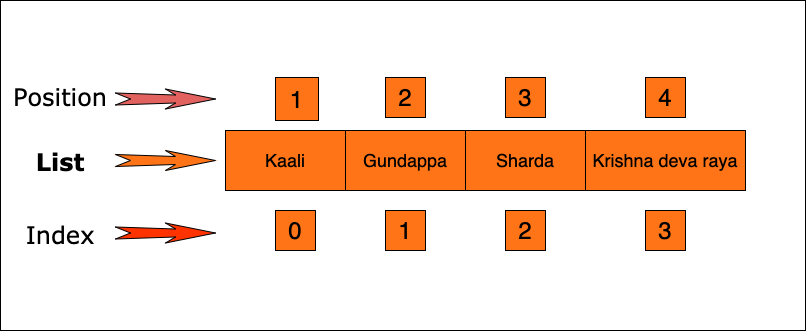

# Pykidz Sessions - Video 4 - Content
## Introduction

Welcome back developers to Pykidz! In the last set of sessions we covered some of the basic topics of python.

We started out knowing why programming and why python. We then installed python and started playing with the shell. We covered the basic data types of python is reasonable depth. After that we created a couple of interactive programs which we can execute whenever we want. Hope you have been following these sessions and working with me. Please remember `I do, I learn!` and this is especially true in development.

In the next set of sessions I will start covering some composite data types. You may not remember me mentioning this in the previous basic data types session. Composite data types are nothing but a collection of data. Let me explain it a bit more.

We all have friends. Notice I said friends in plural. All of us will have at least 2 friends through our life. Many of you will have more than 2 friends right now. So you have a collection of friends - or rather a list of friends! In these sessions related to composite data types we will cover the following ones:

- List - This is the most primary one. We already taked about a list of friends. Today's focus will be on this
- Tuples - This is another type of collection. In developer language we call these as data structures. So lists, tuples and even the upcoming ones are all data structures - structures which store data.
- Maps - While the previous ones are simply a collection of things, a map or a dict is more like a pair with a key which points to a value.
- Sets - This is a collection which is similar to the mathematical concept of set. Even if you don't understand the mathematical concept you will understand it.

I have just listed them out right now and you may not understand them all. That is ok. We will be discussing each one of them in details in these sessions. This session is about **Lists**.

## Comparison operators

Before starting with lists, I want to briefly touch upon one topic. We talked about some of the operators earlier. We specifically covered arithmetic operators. Now I want to briefly discuss comparison operators.

Comparison operators as the names suggests is used to compare different data. The idea is that the operator compares two pieces of data (could be a literal or a variable) and based on the comparison will give back or return a boolean value to signify that the comparison is True or False. You have seen the same thing in mathematics too. You compare data for example numbers to check if they are

-  equal `==` - Yes the symbol is double equal to because the normal equal to is used to signify assignment of data
- not equal `! = ` - This is the symbol to say not equal to. `!` symbol is used to represent not in many languages.  
- greater than `>` , less than `<`, greater than `> = ` , less than `< = ` - - This is similar to mathematics.

Let me show you some examples.

```python
>>> 2 == 2
True
>>> 2 != 3
True
>>> 2 >= 3
False
>>> 2 <= 3
True
>>> 2 < 3
True
>>> 2 > 3
False
>>> 2 == 3
False
>>> a = 33
>>> b = 22
>>> a > b
True
>>> a != b
True
>>> a == b
False
>>>
```

As I said the operators work with both literal values as well as variables. Also the comparison also works with other data types like string. Here is an example

```python
>>> "aa" == "aa"
True
>>> "aa" != "aa"
False
>>> "aa" < "ab"
True
>>> "alone" < "together"
True
```

As you see here, strings are compared in alphabhetcially order. If a character comes early than the other it is considered smaller. As an example `a` comes earlier than `b` and hence is considered smaller.

```python
>>> 'a' < 'b'
True
```

 You will see that the concept of comparison can apply to other data types as well. I think we have got a sense of the basics now. With any further ado let us get into Lists our first composite data type.

## Lists

Lists are nothing but a collection of things. We earlier talked about friends. So let us start by defining friends and in my case friends of Tenali. I will use a string for it.

```python
>>> tenali_friends_str ="Kaali Gundappa Sharda Krishna"
>>> type(tenali_friends_str)
```

I have defined the friends. How many friends does Tenali have? You can probably make an intelligent guess that it is 4. But python cannot. It treats it as one string. It does not understand that each of words are actually separate. So we ideally need a collection of strings or a list of string.

The way you define a list in python is as follows:

```python
>>> tenali_friends =["Kaali","Gundappa","Sharda","Krishna deva raya"] # items in square brackets
>>> type(tenali_friends) # lets find its type
<class 'list'>
```

As you can see this is a type (class) list. With this definition you can see that there are 4 different strings which are the friend names of Tenali. The great thing is that it is just not you but python also knows there are four items.

```python
>>> len(tenali_friends)
4
```

`len` is a built-in function in python which gives a length of an object. It is supported by many data types in python. And list is one of them and it tells clearly that the list has 4 items in it. That is the count of friends. `len` can be used with strings also but the output will be very different. I suggest you to try out and see.

Now that we have defined a list, let us figure out what we can do with this list.

### Accessing elements of a list

One of the things we want to do with a created list is to get back the items from the list. You can get these items to print them or do something else with them.

One of the specialities of a list is that it is collection that is indexed. Let me explain that a bit. Items stored in a list are added one after the other and each of them is given a position. So when the first element is added to a list then that element is in the first position of the list. Actually that is not exactly right. The first element will be in the zeroth position or zeroth index of the list. I think I will show you.

```python
>>> tenali_friends
['Kaali', 'Gundappa', 'Sharda', 'Krishna deva raya']
```

This shows our list. Let me try to access elements in the list.

```python
>>> tenali_friends[1] #Suffice the list var with [] & number indicating position 1
'Gundappa'
```

What happened here? I asked for 1 position, so I should have got `Kaali` but I got `Gundappa`. Let me try again

```python
>>> tenali_friends[0]
'Kaali'
```

So as I said the first position is one the zeroth index. So now you have able to access list items using index. Let me access each of these items and show you

```python
>>> tenali_friends[0] # 0 index 1st element
'Kaali'
>>> tenali_friends[1] # 2nd element so index is 1
'Gundappa'
>>> tenali_friends[2] # index 2 so it is the 3rd element
'Sharda'
>>> tenali_friends[3] # 4th element and index is 3
'Krishna deva raya'
```



Now we have accessed all the elements of our friends array. What happens if we try to access with index 4 which will give us the 5th element. But there is no 5th friend in our list. Let us try and see.

```python
>>> tenali_friends[4]
Traceback (most recent call last):
  File "<stdin>", line 1, in <module>
IndexError: list index out of range
```

Python complains and rightly so. And look at the message. It says `list index out of range`. Since this list has four elements the range of indexes start from 0 and stops at 3. But we tried index 4 and hence python complains. Keep in mind this error so that when you encounter this you know what mistake you are doing.

We just used indices on lists to get the value of the item from the list. Can we use that technique to update values? Let us give it a shot.

```python
>>> tenali_friends[3] = "Krishna" # use index and assign a value
>>> tenali_friends # let us look at the list
['Kaali', 'Gundappa', 'Sharda', 'Krishna']
```

You see that the last element in the list has changed. So using the same indexing technique we are also able to update values in a list.

I will leave you with an exploration of your own. What happens if you do this?

```python
>>> tenali_friends[-1]
```

I will not execute this. It is for you to try and discover on your own. Don't be scared. If you do something wrong python will cry at you but that is ok. It will forget it almost immediately. :-)

### Slicing lists

There is another interesting thing you can do with lists. Let us define a new list. We will define a list of fruits this time with say 8 fruits.

```python
>>> fruits = ['apple','banana','fig','guava','jackfruit','kiwi fruit','lemon','mango']
>>> len(fruits)
8
```

Ok. That list is defined now. Python allows you to `slice` lists. Slicing in english means getting a part of something. So by slicing a list we can get a part of the list.

Let us say, we want the first 3 fruits in the list. What will you do? We can access them one by one like this:

```python
>>> fruits[0]
'apple'
>>> fruits[1]
'banana'
```

I just did two and I am already tired and bored. Let us try something different.

```python
>>> fruits[0:3]
['apple', 'banana', 'fig']
```

So what happened. I was able to get a new list of the 3 fruits I wanted. Slicing in python is done by using the syntax

`list name[starting index:ending index + 1]`

So I wanted the first 3 items. This means I wanted items from index 0, 1 and 2. So in the slice approach the first argument is 0 - starting index. The last argument is ending index + 1 i.e. 2 + 1 = 3. That is exactly what I did. Let us try a few more examples.

Let us try to get the last 3. I will try this:

```python
>>> fruits[4:8]
['jackfruit', 'kiwi fruit', 'lemon', 'mango']
```

That is not last 3. It is last 4. So I got my indexes wrong. Since there are 8 fruits, the index values start from 0 and go upto 7. So the last 3 indexes are 5,6 and 7. So the slice values should start with 5 instead of 4. The end value should 7 + 1 = 8, which I have got right. Let me try changing the starting index.

```python
>>> fruits[5:8]
['kiwi fruit', 'lemon', 'mango']
```

That worked. So always get your indexes right. Practice slicing out different parts of the list and see if you are getting the expected answers with the index values you provide.

Now, python always tries to make our life easy wherever it can. I am going to show you a shortcut to reduce the amount of typing.

```python
>>> fruits[5:]
['kiwi fruit', 'lemon', 'mango']
```

So here I left off the second argument - ending index + 1. Python understood that as you want to start from element at index 5 to the end of the list. And that is what we wanted. If we want the first 4 elements i.e from indexes 0 - 3, I can use another shortcut.

```python
>>> fruits[:4]
['apple', 'banana', 'fig', 'guava']
```

So now I dropped the starting index (first argument) and put the ending index + 1 value of 4 (second argument). So python says that you want another list which has elements that start from beginning and go upto 4th index but don't include the 4th index - so the 3rd index. 0-3. Exactly what we want.

Note that I am calling these arguments because we are passing these values to the slicing operator, but it is not passed like arguments to a function. In a function different arguments are separated by commas. In the slicing operator the separation is done using `:`s.

There is more with slicing. Let us see our fruit list again.

```python
>>> fruits
['apple', 'banana', 'fig', 'guava', 'jackfruit', 'kiwi fruit', 'lemon', 'mango']
```

So we have eight fruits and let us say we want fruits which are in odd position. So position 1, 3, 5, 7. Always remember position 1 means index 0, position 3 means index 2 and so on. So the expected answer is `['apple', 'fig', 'jackfruit', 'lemon']`. Slicing in python allows you jump or stride ahead in steps. I will show you now

```python
>>> fruits[::2]
['apple', 'fig', 'jackfruit', 'lemon']
```

What am I doing here? There are two colons in this syntax. The value before the first colon (first argument) is supposed to be the starting index. Since I have not provided any value python will take it as 0. The value after the first : i.e the second argument, is supposed to be end index + 1. Again since I have not provided any value it will take it as the last index +1: `7+1 = 8` in our case. Then there is the second : and a value after that. This is the new third argument. This value is 2 and that tells python to jump by 2 steps instead of the default or usual 1 step. Earlier I never gave this value (and hence did not add the extra :) and python assumed (or I should say *defaulted* to) the value is 1 and hence did not jump. But since I have given a value here it will in 2 steps. So it starts at 0, then jumps by 2 and hence reaches the 2nd index. Then again it jumps by 2 and reaches the index 4 and so on. That is how we got our values. If we want even fruits, we have do a small tweak. Before you see the solution next, pause your video and try it now.

Ok. Did you get it? If not, it is not a problem. Here is how you can do it.

```python
>>> fruits # see your list
['apple', 'banana', 'fig', 'guava', 'jackfruit', 'kiwi fruit', 'lemon', 'mango']
>>> fruits[1::2]
['banana', 'guava', 'kiwi fruit', 'mango']
```

So we wanted the 2 stride so kept that as is. The only change we did was to give a different start index - 1 which corresponds to position 2.

Earlier we used indexes to update list elements. I accessed one element using the index and assigned a new value to it. With slicing you are do the same with multiple values. Let us look at our fruit list again.

```python
>>> fruits
['apple', 'banana', 'fig', 'guava', 'jackfruit', 'kiwi fruit', 'lemon', 'mango']
```

My daughter does not like jackfruit and kiwi fruit that much. She would rather want me to replace them with orange and plum fruits. So let us try to do that. As usual let us do it in small steps. Let us first figure out if we can access the right elements with our slicing indices. Once we get that right, we can easily do the assignment.

Since the jackfruit is in the fifth position our starting index will be 4. And second argument to the slicing syntax will be 6. So let us try it out.

```python
>>> fruits[4:6]
['jackfruit', 'kiwi fruit']
```

Bingo! We got the right. Now that we are able to access the right values, we can now use assigment to replace the values. Since we are assigning multiple values we need to assign a list itself and not individual values. Let me show you:

```python
>>> fruits[4:6] = ['orange', 'plum']
```

Hmmm... did that work. Let us actually look at the fruits list to check:

```python
>>> fruits
['apple', 'banana', 'fig', 'guava', 'orange', 'plum', 'lemon', 'mango']
```

Cool. That worked!

I think we have done enough slicing for now. I will leave you again with this idea to play with.

```python
>>> fruits[:-2]
```

You can guess what will happen. And then actually try it out!

### List can contain anything

Till this point we have been looking at lists of strings. You might have started thinking that lists are always a list of strings. That is not the case. List can have almost any datatype. It can have integers, floats, booleans and even other lists. A single list can have different data types too. Let me show you some examples.

- A list of integers

```python
>>> tenali_integers = [2,5,6,78,1002,32]
>>> tenali_integers
[2, 5, 6, 78, 1002, 32]
>>> type(tenali_integers)
<class 'list'>
```

The type is a `tenali_integers` is list. Let us do the next one.

- A list of floats

```python
>>> tenali_floats = [2.5,3.14,55.22,12142.212,324.11]
>>> tenali_floats
[2.5, 3.14, 55.22, 12142.212, 324.11]
>>> type(tenali_floats)
<class 'list'>
```

Again the type is list. So irrespective of what the list contains the datatype or class of a list is always list in python. Moving on.

- A list of booleans

```python
>>> booleans_of_the_world = [True,False]
>>> type(booleans_of_the_world)
<class 'list'>
```

I have created a list of two booleans here since there are really only two different boolean values. That does not mean that you can only create items of different values in a list. You can repeat the same value again and again.

```python
>>> booleans_repeated = [True,False,False,True,True,False]
>>> len(booleans_repeated)
6
```

The repetition is allowed for other types like integers and floats also. So a list allows items inside it to be duplicate. Please remember this. It will come in handy later. Next one

- Mixing things together

```python
>>> mix_it_up = [1,2,'three',4.0,'five',6,7.0,'eight']
>>> type(mix_it_up)
<class 'list'>
```

We can add booleans too.

```python
>>> mix_it_up_more = [False,1,2,'three',4.0,'five',6,7.0,'eight',True]
>>> type(mix_it_up_more)
<class 'list'>
```

Now for the last one which will add another list into a list.

```python
>>> super_mix = [1, 2.0, 'three',[4,5.0,'six'],7,8.0,'nine']
```

Ok. I have mixed up everything here. I left booleans out for no particular reason. In the above case what do you think is the length of this list is. I have typed in numbers from 1 to 9 but ofcourse in different data types. Let us check the length out

```python
>>> len(super_mix)
7
```

Did you expect that? You should remember `[4,5.0,'six']` is a list on its own and is added to `super_mix` as one item. The items inside that list are not items of the outer list. The outer list considers the entire inside list as just one item. Don't let this trip you when you start working with list of lists later.

There are more types that can be added to a list but I think this is sufficient for you get an idea that we can use lists to create a collection of almost anything. Having said that when you do actual development you generally don't mix up different types of data in the same list. Generally you will a list of strings or list of integers and not both together. Lists containing lists are something you will potentially use but again each list inside the main list will contain data of the same type most of the time. This is something to keep in mind.

### Adding and removing items from a list

Till now we declared lists and we accessed and changed the items in the list. But don't we need to add more items or remove them.

Let us get back to list of friends. This time we will take the friends of Bhimasen.

```python
>>> bhimasens_friends = ['Yudhishtira', 'Arjuna', 'Nakula', 'Sahadeva']
```

All his brothers were his friends right? So now Bhimasen has 4 friends. Later on he got another friend - you know who? Krishna. Now we need to add him to his friends list. How do we do that?

In one of our previous sessions you might remember we converted a string to its upper case by using something called method calling. Let me show you again

```python
>>> s = 'Tenali'
>>> print(s.upper())
TENALI
```

Here the data type of string is manipulated by calling a method on the data type. So some data types have methods that can be called on them to manipulate them.

Lists also support methods but they need not be same as the ones supported by string. Like making a string upper case make sense. But making a list of numbers (remember list can contain just numbers) upper case does not make sense. So lists support different methods.

We want to add `Krishna` to the Bhimasen's friends list. So we will use the `append` method present in lists. Append means adding something at the end. So the `append` method adds a new item to the end of the list. This should work. Let us add `Krishna`.

```python
>>> bhimasens_friends
['Yudhishtira', 'Arjuna', 'Nakula', 'Sahadeva']
>>> bhimasens_friends.append('Krishna')
>>> bhimasens_friends
['Yudhishtira', 'Arjuna', 'Nakula', 'Sahadeva', 'Krishna']
```

So the append worked. You can add more friends to this list. Let us get a bit naughty and add `'Duriyodhana'` to the list of Bhimasen's friends.

```python
>>> bhimasens_friends.append('Duriyodhana')
>>> bhimasens_friends
['Yudhishtira', 'Arjuna', 'Nakula', 'Sahadeva', 'Krishna', 'Duriyodhana']
```

Of course we know he is not a friend. So we need to `remove` that item( I mean friend) from the list. We will use a different list method for this - `remove`

```python
>>> bhimasens_friends
['Yudhishtira', 'Arjuna', 'Nakula', 'Sahadeva', 'Krishna', 'Duriyodhana']
>>> bhimasens_friends.remove('Duriyodhana')
>>> bhimasens_friends
['Yudhishtira', 'Arjuna', 'Nakula', 'Sahadeva', 'Krishna']
```

So we have corrected our mistake using the list's `remove` method. There are other ways to delete elements from a list. There are also a lot of other methods on lists. We will not look at them here. You can investigate them by searching for it in the documentation

https://docs.python.org/3/tutorial/datastructures.html#more-on-lists

To end the part, let me give you something to try. Suppose you added *Duriyodhana* twice in the list. What do you think calling the `remove` method will do? Guess first and then try it on.

### List arithmetic?

Let us now move forward with lists and figure out if there we can do some operations with them. Let us start with our favorite operation: `+`. We will get our list of *Tenali* and *Bhimasen* friends and add them together.

```python
>>> tenali_friends
['Kaali', 'Gundappa', 'Sharda', 'Krishna']
>>> bhimasens_friends
['Yudhishtira', 'Arjuna', 'Nakula', 'Sahadeva', 'Krishna']
>>> tenali_friends + bhimasens_friends
['Kaali', 'Gundappa', 'Sharda', 'Krishna', 'Yudhishtira', 'Arjuna', 'Nakula', 'Sahadeva', 'Krishna']
```

I think that was not surprising. We took two lists and added them together and got back a list with friends of both *Tenali* and *Bhimasen*. The more **developer** term is to say that we *concatenated* the two lists. Let us quickly check if the original lists got changed.

```python
>>> tenali_friends
['Kaali', 'Gundappa', 'Sharda', 'Krishna']
>>> bhimasens_friends
['Yudhishtira', 'Arjuna', 'Nakula', 'Sahadeva', 'Krishna']
```

So there is no change in the original lists. So the `+` operator creates a completely new list and copies over all the contents into the new list. Let us see if changing the new list has any impact on the original lists.

```python
>>> all_friends = tenali_friends + bhimasens_friends # we assign the output to a new variable all_friends
>>> all_friends
['Kaali', 'Gundappa', 'Sharda', 'Krishna', 'Yudhishtira', 'Arjuna', 'Nakula', 'Sahadeva', 'Krishna']
```

Now we have the new list. We notice that there are two *Krishna*s in the new list. Actually the first value refers to the king *Krishna Deva Raya*. So to reduce confusion let us change that. We can change values by accessing it by their index (we have seen this earlier).

```python
>>> all_friends[3] = "Krishna Deva Raya"
>>> all_friends
['Kaali', 'Gundappa', 'Sharda', 'Krishna Deva Raya', 'Yudhishtira', 'Arjuna', 'Nakula', 'Sahadeva', 'Krishna']
```

So we accessed index 3 and changed the value. The `all_friends` list is corrected now. But did this change what is present in `tenali_friends` list. Let us check that quickly.

```python
>>> tenali_friends
['Kaali', 'Gundappa', 'Sharda', 'Krishna']
>>> bhimasens_friends # For good measure let us check the other list too.
['Yudhishtira', 'Arjuna', 'Nakula', 'Sahadeva', 'Krishna']
```

So both the original lists are not affected. This proves that the `+` operator creates a new list and copies the contents over to the new list. It does not affect the original lists. This fact is generally a good thing since it means things don't change unless you change it explicitly.

Now moving on to the next operator which lists support: `*`

 ```python
>>> [2] * 3
[2, 2, 2]
>>> [2,5] * 3
[2, 5, 2, 5, 2, 5]
 ```

Just like Strings using the `*` operator created repetition of elements. Let us now check if it creates a new list or changes the original list.

```python
>>> repeated_friends = tenali_friends * 3
>>> repeated_friends
['Kaali', 'Gundappa', 'Sharda', 'Krishna', 'Kaali', 'Gundappa', 'Sharda', 'Krishna', 'Kaali', 'Gundappa', 'Sharda', 'Krishna']
>>> tenali_friends
['Kaali', 'Gundappa', 'Sharda', 'Krishna']
```

 As you see there is a new list created and the original list is left unchanged. Let us leave it there.

Ok. Just because we were able to do `+` and `*` , you might be tempted to think that we can do `-` and `/`. No they are not supported. As I said earlier Python does not try to assume things or try to be oversmart about things. With respect to `+` and `*` , the purpose is very clear and unambiguous. Dividing a list can be done in many ways and python cannot do it in a consistent manner. Similarly for `-` too. Lists act very much like strings do in this regard. You will see more similarities between the two as you move forward in your python developer journey.

### List comparisons

We started this session with comparison operators. So, let us see if we can use them with lists.

Let us start with the comparison of whether two lists are equal or not. For this we need the `==` operator. As a simple first step, you will agree with me that a list is equal to itself. Let us try that.

```python
>>> tenali_friends == tenali_friends
True
```

If we try to compare completely different lists then they obviously shouldn't be equal. Let me show this:

```python
>>> tenali_friends
['Kaali', 'Gundappa', 'Sharda', 'Krishna']
>>> bhimasens_friends
['Yudhishtira', 'Arjuna', 'Nakula', 'Sahadeva', 'Krishna']
>>> tenali_friends == bhimasens_friends
False
```

That is understandable. What about creating another list of tenali friends which have the same contents. Let us call it `t_friends`

```python
>>> t_friends = ['Kaali', 'Gundappa', 'Sharda', 'Krishna']
>>> tenali_friends == t_friends
True
```

As you can see it is contents that matter. As long as the contents are same then the two lists are equal. But there is something more. Let us create `t2_friends` variable with the same contents but with a twist.

```python
>>> t2_friends = ['Kaali', 'Sharda', 'Gundappa', 'Krishna'] # same elements but different order
>>> tenali_friends == t2_friends
False
```

Here we have the same elements but the order in which they appear is different. When that happens then lists are not considered equal. So in a list the order of elements matter a lot. If the order of elements is changed then it is considered as a different list. Keep this property of a list always in mind.

Now let us look at some other comparison operators. Let us try greater than and less than.

```python
>>> [1,3,5] > [1,5,3]
False
>>> [1,3,5] < [1,5,3]
True
```

Here we have two integer lists and we try to compare them. As you can see the list `[1,5,3]` is considered greater than than the other. We have the same elements in both but the order is different. And the comparison is done in the order. In this case on index 0 both lists have 1. But on index 2 the second list has 5 and first list has 3. And since 5 is greater than 3, python declares the second list to be greater. Hence the comparison is always done in order. Let us take another example to understand it better

```python
>>> [1,6] > [1,5,3]
True
```

In this example the first list has lesser elements than the second one. But yet it is considered greater. Again the reason is that the comparison is in order. First element in both is 1 and hence python moves on to compare the second item. Since 6 is greater than 5, python immediately declares the first list to be greater. It does not compare the next element. So even if the comparison was like this:

```python
>>> [1,6,0] > [1,5,3]
True
```

where the last element in the first list is smaller, it does not matter. Python already decided the first list is greater. When the comparison is for equals then python will look at each and every element before declaring it as equal.

If you think about it this behaviour makes sense. It works very similar to how we compare strings. If we tried to order `'tenali'` and `'tree'` in alphabetical ascending order, you will first put `tenali` and then only put `tree`. Python does the same thing with strings too.

```python
>>> 'tenali' < 'tree'
True
```

Try this comparison with capital letter strings too as an exercise.

With lists it does a similar thing. In strings the comparison is done between each character in the corresponding position in each of the strings. In lists, comparison is done between each item in the corresponding position on each of the lists. Let us compare our friend lists

```python
>>> tenali_friends
['Kaali', 'Gundappa', 'Sharda', 'Krishna']
>>> bhimasens_friends
['Yudhishtira', 'Arjuna', 'Nakula', 'Sahadeva', 'Krishna']
```

If you look at these two lists, python will first compare the first element in each list. So the comparison is between `'Kaali'` and `'Yudhishtira'` and alphabetically `'Yudhishtira'` is greater than `'Kaali'` (as per their own stories this may not be true ;-)). So when we compare them:

```python
>>> tenali_friends > bhimasens_friends
False
```

 As expected `tenali_friends` are smaller than `bhimasens_friends`.

I think we have done enough comparisons between lists.

### List membership

Now let us look at different kind of comparison. Many a times we want to know if a particular thing is present in a list or not.  For example we want to know if `'Krishna'` is present in Bhimasen's friends list. Let us look at the list first:

```python
>>> bhimasens_friends
['Yudhishtira', 'Arjuna', 'Nakula', 'Sahadeva', 'Krishna']
```

We can visually see that it is there, but how do we check this with python so that python can tell if it is true or not. You might ask why python should be able to tell this. The answer for this will come when we cover conditional statements in python in a future session. At that time you will find that knowing something is true or false is a very powerful thing in programming.

Ok. Let us get to figuring out how to check if `'Krishna'` is present in `bhimasens_friends`. This is called testing for *List membership*. We will use the `in` operator supported for python lists.

```python
>>> 'Krishna' in bhimasens_friends
True
```

Here we are asking the question "Is Krishna present `in` bhimasens_friends" and python tells you *Yes* by returning `True`

If you ask if `'Duriyodhana'` is `in` bhimasen's friends:

```python
>>> 'Duriyodhana' in bhimasens_friends
False
```

 And the answer is No - `False`

Instead of asking if `Duriyodhana`is present, we might want to ask if he is not present. We can do that too - just do a small tweak:

```python
>>> 'Duriyodhana' not in bhimasens_friends
True
```

That is very clear is it not.

Now you should be keep in mind that Python cannot understand your intentions. You have to be precise in the questions you ask it. Let me give you an example. Instead of asking if `'Krishna'` is present in `bhimasens_friends` if you ask `'Krishnan'` is present in the friends list, what do you think Python will say?

```python
>>> 'Krishnan' in bhimasens_friends
False
```

You might be able to judge that the user's intention is to ask if *Krishna* is there or not but Python does not try to decipher such things. It needs you to be precise and correct. This aspect applies to all programming languages and not just python. That is why computers are sometimes called as idiot boxes. Computer languages always force you to be accurate in how you use them. That is the only way they know to ensure that when they are doing some work for you they are doing exactly what you want.

### List Truthiness

We have covered a lot of ground on lists. Before closing this session on lists I want to cover just one more aspect of lists. You might remember that when we talked about booleans, I had said that other data types also have the concept of truthiness. I had mentioned that any non-zero number is supposed to truthy and 0 is supposed to be falsy. I will show this just to jog your memory. If you cast integers to booleans using the built-in `bool` function you will understand what I mean

```python
>>> bool(-1)
True
>>> bool(10)
True
>>> bool(0)
False
```

As you see any non-zero integer value when cast to boolean shows `True`. 0 is treated as `False`.

If you extend the same concept to lists what do you think is the falsy value.

You guessed right! An empty list is considered falsy. An empty list is expressed as `[]` . Let us see

```python
>>> []
[]
>>> bool([])
False
```

If you try with a list with even one value it becomes truthy. It does not matter what the value itself is:

```python
>>> bool([0])
True
```

Here the list has one value and that value is 0. Though the value is 0, since the list has more than one item it is considered truthy. This is different from list comparison where the value of the contents mattered.

Inorder to understand this better, a list is considered to be true if the length of the list is greater than 0. If the length is 0 then it is considered as falsy. No check is made for finding the actually contents of the list.

```python
>>> len([])
0
>>> len([0])
1
```

So empty list length is 0 and is falsy. Non-empty list length is greater than 0 and hence is truthy. If you find this confusing don't worry too much. Once you practice and play with python more any confusion related to this will get clarified.

## Conclusion

At this point I think we should close this session. Hopefully you got a good understanding of Lists in python. In the upcoming sessions we will cover other composite datatypes like dicts, sets and tuples. Please use comments to ask your doubts. And keep learning by trying thing out. Remember, I do, I learn! See you around.
