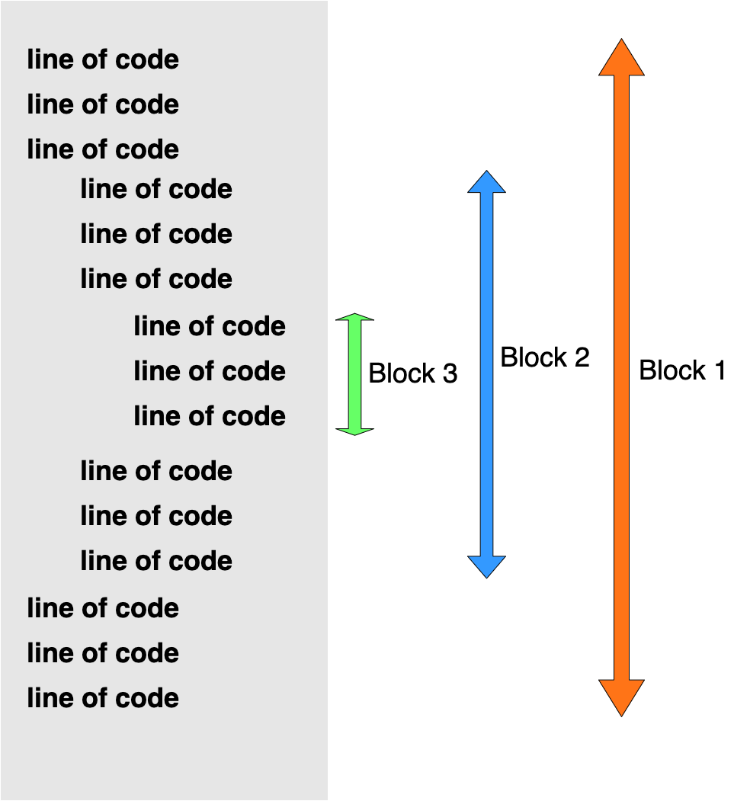
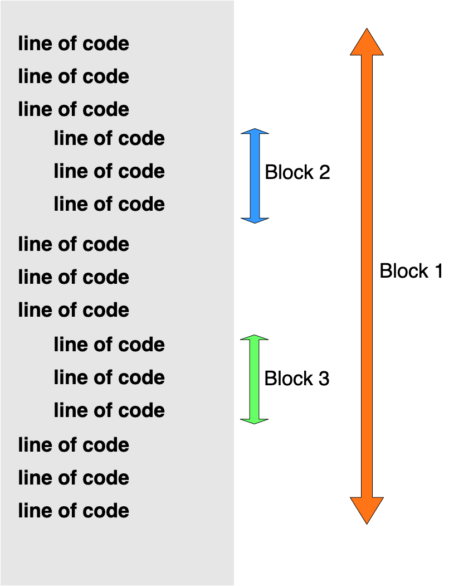

## Conditionals

Sequential execution till now.

- execution is word for running a program

Real world is more complicated - evaluate real world information and  skip statements or chose a different set of statements or repeat execute a series of statements

- Statement is a line of meaningful python code

We need a way to control structure or flow

- directs the order of execution of statements in a program

### `if` statement

```python
if <expr>:
	<statement>
```

Expression is a statement which will evaluate to some value. but here it is understood as a boolean - so the value should be a boolean or python will evaluate the truthy nature of the value.

`if` truthy execute statement

```python
>>> age = 10
>>> age <= 12 #True
```

Refer to comparison operators done before before. Use your conditional operators on various data items

Let us get into a python file - `age_commenter.py`

`<file: age_commenter.py: before>`

```python
name = input("Please give me your name: ")
age = int(input("Please give me your age: "))
spl_adj = ""
greeting = f"Hi {spl_adj}! {name}, you {age} year old!"
print(greeting)
# No commenting yet
```

We have to be intelligent on commenting

`<file: age_commenter.py: first comment>`

```python
name = input("Please give me your name: ")
age = int(input("Please give me your age: "))
spl_adj = ""
if age <= 12:
    spl_adj = "Whizzo Kiddo"
greeting = f"Hi {spl_adj}! {name}, you {age} year old!"
print(greeting)
# Execute with age 12, less and more.
```

We are no longer doing linear execution. We have conditional execution - control flow

---
---

### Block

Let us do more. Let us create an activity suggester.

`<file: activity_suggester.py: single activity>`

```python
weather_good = input("Is the weather good outside? (Answer Yes/No): ")
if weather_good.upper() == 'YES':
    print("Go out for cycle ride!")
print("Ok bye!")
```

Why just one activity? Let us do more. So we need to have multiple statements

`<file: activity_suggester.py: multiple activity>`

```python
weather_good = input("Is the weather good outside? (Answer Yes/No): ")
if weather_good.upper() == 'YES':
    print("Go out for cycle ride!")
    print("Play cricket with friends!")
    print("Walk in the park...")
print("Ok bye!")
```

We call these multiple statements, a compound statement or block. Sort of collection of blocks

- all languages provide a way for this
- python does it by indentation

Time to talk about

### W h i t e s p a c e

Whitespace is the blank character to separate things like identifiers, keywords, literals and operators - most times it is not required. But it improves readability.

`<file: whitespace.py no>`

```
n1=100
n2=200
v=(n+n2*20)*(n1*10-n2)
```

Not readable. Now you can format using a keyboard shortcut

```shell
On Windows: 	Shift + Alt + F
On Mac: 			Shift + Option + F
On Linux:			Ctrl + Shift + I

# Or Command Palette and search for Format Document
On Windows/Linux:	Ctrl + Shift + P
On Mac:						Command + Shift + P
```

This would install something - `autopep8`

```bash
# Actual command run by vscodium
▶ /usr/local/bin/python3 /Users/apple/.vscode-oss/extensions/ms-python.python-2020.10.332292344/pythonFiles/pyvsc-run-isolated.py pip install -U autopep8 --user
```

I have already done it so it won't come up for me. Once installation is complete, run the command again.

There you go! That is much more readable

Whitespace is something which we use in writing code in all languages. Python uses it a bit more.

There is a standard way of using whitespace in python. It is covered under PEP 8 - https://www.python.org/dev/peps/pep-0008/  PEP - **Python Enhancement Proposal**

This covers what is the right way to write code in python beyond just python syntax. The idea is to make your code more readable for others.

What we installed just now is a tool which will help you to follow these guidelines automatically when you use that shortcut to format document. But at some point I suggest you to read this document. It will be a good learning exercise.

### Back to Blocks

Python uses indentation to define a block or set of related statements.

Indentation can be done with space or tab. But it needs to be uniform.

Editors will allow tabs to be treated as spaces. That is what is happening in mine. It is a setting but don't worry about it.

Now let us go back to `activity_suggester.py` and play with indentation

- Top line indenting change and run (error)
- Correct and run (no error)
- if block change line to reduce indent and run (error)
- reduce indent of if block item to normal one and show (semantic difference)

So it is the indent in python that tells you that the code belongs to a block. We changed the indent and it changed the block it belonged to.

Let us see some illustrations

Nested 3 level block




Double nested 2 level block



Other languages do block differently - `{}` is common

Indentation for blocks is good for some- clean, consistent, identation and code flow matches - so better visualisation, forces to maintain standards and hence better readability

The bad part (at least some feel not me) - people don't like to not have choice. I actually don't want choice here.

Other issue - editors mix space and tab - causing confusion

But for python, this is mandatory

---
---

### The `else` clause

```python
if <expr>:
	<statement(s)>
else:
	<statement(s)>
```

Let us get back to our activity suggester. What if the weather is not good? Our current suggester does not say anything in that case. We will now change that.

`<file: activity_suggester.py: if and else>`

```python
weather_good = input("Is the weather good outside? (Answer Yes/No): ")
if weather_good.upper() == 'YES':
    print("Go out for cycle ride!")
    print("Play cricket with friends!")
    print("Walk in the park...")
else:
    print("Play a game of carrom or chess")
    print("Chat with family!")
    print("Take a nap...")
print("Ok bye!")
```

Execute and see.

Now try saying something else than `No`  - `I don't know`. See what happens.

Not very intelligent. We will see more... But let us see one more example. Our `age_commenter.py` does not provide any smart comment for age greater than 12. Let us change that

`<file: age_commenter.py: if and else>`

```python
name = input("Please give me your name: ")
age = int(input("Please give me your age: "))
spl_adj = ""
if age <= 12:
    spl_adj = "Whizzo Kiddo"
else:
		spl_adj = "Oldie Moldie"
greeting = f"Hi {spl_adj}! {name}, you {age} year old!"
print(greeting)
```

That is more interesting for sure. But again we don't want to call 15 and 21 year olds as `Oldie Moldie` . Our commenter needs to do better

### The `elif` clause

Let us look at both our examples:

The activity suggester is not really working as expected. We ideally want it to check if the answer is actually `No` . So we want to check a condition again. How do we do that?

The `elif` clause to the rescue:

```python
if <expr>:
	<statement(s)>
elif <expr>:
	<statement(s)>
elif <expr>:
	<statement(s)>
else:
	<statement(s)>
```

The `elif` clause actually is the short form of **else if** . So the idea is we say if A then do action 1, else if B then do action 2, else do something else. An example will help to understand.

Of course let us go back to `activity_suggester.py`

`<file: activity_suggester.py: if, elif and else>`

```python
weather_good = input("Is the weather good outside? (Answer Yes/No): ")
if weather_good.upper() == 'YES':
    print("Go out for cycle ride!")
    print("Play cricket with friends!")
    print("Walk in the park...")
elif weather_good.upper() == 'NO':
    print("Play a game of carrom or chess")
    print("Chat with family!")
    print("Take a nap...")
else:
    print("If you can't answer this question properly...")
    print("You should go back to bed!")
print("Ok bye!")
```

Execute and check - `No` and `Wha`

Now that is much better. Our `activity_suggester.py` is little more intelligent now. Shall we make our age_commenter also better?

Open up `<age_commenter.py>`

Less than age is already good. But other part is not so good. If people in their teens are called Oldie Moldie they might get very angry and do something very angry. And people in the 20's would probably be disappointed and walk away. Or it could vice versa. People in 30s probably become mildly level headed to accept the current remark. Of course completely based on my own thought process. Your own experience might be very different.

So let us make the changes.

`<file: age_commenter.py if, else and elif>`

```python
name = input("Please give me your name: ")
age = int(input("Please give me your age: "))
spl_adj = ""
if age <= 12:
    spl_adj = "Whizzo Kiddo"
elif age < 20:
    spl_adj = "Super Teen"
elif age < 30:
    spl_adj = "Vibrant Youth"
else:
    spl_adj = "Oldie Moldie"
greeting = f"Hi {spl_adj}! {name}, you {age} year old!"
print(greeting)
```

Run `python age_commenter.py` - Try with age Bheem - 10, Krishna - 16, Arjun - 25, Tenali - 34

Now try Duri - - 1. That does not make sense. How do we fix this?

`<file: age_commenter.py if, else and elif>`

```python
name = input("Please give me your name: ")
age = int(input("Please give me your age: "))
spl_adj = ""
if age < 0:
    spl_adj = "Mr Unborn"
elif age <= 12:
    spl_adj = "Whizzo Kiddo"
elif age < 20:
    spl_adj = "Super Teen"
elif age < 30:
    spl_adj = "Vibrant Youth"
else:
    spl_adj = "Oldie Moldie"
greeting = f"Hi {spl_adj}! {name}, you {age} year old!"
print(greeting)
```

Try -1 again. And that is better

---
---

### Nesting & Combining Conditions

I want to show you couple more things on these conditionals.

If you look at the `<activity_suggester.py>`, it suggests a few activities without asking some more relevant questions.

It suggests to go out for a cycle ride without asking you if own a cycle. Similarly it is asking you to play cricket without knowing if you have the equipment. Let us remedy one of these issues.

Open `<activity_suggester.py>`. Let us fix the cycle one.

```python
weather_good = input("Is the weather good outside? (Answer Yes/No): ")
have_cycle = input("Do you have a cycle? (Answer Yes/No): ")
if weather_good.upper() == 'YES':
  	# If the weather is good we want to check if the user has cycle before suggesting that.
    if have_cycle.upper() == 'YES':  
        print("Go out for cycle ride!")
    print("Play cricket with friends!")
    print("Walk in the park...")
elif weather_good.upper() == 'NO':
    print("Play a game of carrom or chess")
    print("Chat with family!")
    print("Take a nap...")
else:
    print("If you can't answer this question properly...")
    print("You should go back to bed!")
print("Ok bye!")
```

Execute - `python activity_suggester.py` with `No` and `Yes`

Now you see nesting of conditions. An `if` within an `if`

Let us also say that we will suggest walk in the park for people who don't have a cycle. Let us do that and see:

```python
weather_good = input("Is the weather good outside? (Answer Yes/No): ")
have_cycle = input("Do you have a cycle? (Answer Yes/No): ")
if weather_good.upper() == 'YES':
    if have_cycle.upper() == 'YES':
        print("Go out for cycle ride!")
    else:
        print("Walk in the park...")
    print("Play cricket with friends!")
elif weather_good.upper() == 'NO':
    print("Play a game of carrom or chess")
    print("Chat with family!")
    print("Take a nap...")
else:
    print("If you can't answer this question properly...")
    print("You should go back to bed!")
print("Ok bye!")
```

Execute - `python activity_suggester.py` with `No` and `Yes`

So now you see a nested `if else` within an `if`. The level of nesting you can have is pretty much infinite from a syntax perspective. But a lot of nested conditional statements makes the program very complicated to understand at some point. The current example is pretty much manageable but if we keep going on nesting then at some point things will become crazy. Keep that in mind.

Now for the last trick.

Open `<age_commenter.py>`. Let us tweak it... Let us change the order of the conditions

```python
name = input("Please give me your name: ")
age = int(input("Please give me your age: "))
spl_adj = ""
if age < 0:
    spl_adj = "Mr Unborn"
elif age < 20:
    spl_adj = "Super Teen"
elif age < 30:
    spl_adj = "Vibrant Youth"
elif age <= 12:
    spl_adj = "Whizzo Kiddo"
else:
    spl_adj = "Oldie Moldie"
greeting = f"Hi {spl_adj}! {name}, you {age} year old!"
print(greeting)
```

Let us execute this `Frodo - 11` - Woah! What happened? 11 is not a teen! So the way we wrote our conditions was it became important that the order of conditions mattered. This is ok at times. Other times we want to be sure that our conditions are very independent of one another.

```python
name = input("Please give me your name: ")
age = int(input("Please give me your age: "))
spl_adj = ""
if age < 0:
    spl_adj = "Mr Unborn"
# A teen is somebody whose age is more than 12 and less than 20
elif age > 12 and age < 20:
    spl_adj = "Super Teen"
# A youth is somebody whose age is more than 19 and less than 30
elif age > 19 and age < 30:
    spl_adj = "Vibrant Youth"
# A kid can be of any age between 0 and 12
elif age >= 0 and age <= 12:
    spl_adj = "Whizzo Kiddo"
else:
    spl_adj = "Oldie Moldie"
greeting = f"Hi {spl_adj}! {name}, you {age} year old!"
print(greeting)
```

Try 11 again. Then Sam - 16, Legolas - 25, Aragon - 34

So `and` allows us to combine two conditions. The two conditions together are true only if both conditions are true. If one of them is false then entire condition is false.

There is one more such combiner - `or` -  `if this or that then do something` - I will leave you to try out examples on this one.

That is it we are done with conditionals

---
---

## The None

Before I let you go I want to talk about just another key concept. I promise to stop with that.

Sometimes we want to variables to point to nothing. There is a concept of `null` in other languages which refers to something which is nothing. A variable which is empty is supposed to point to null. Some languages use 0 to represent it but not Python.

Python uses the keyword `None` to represent null objects. It is not the same as 0. It is a different thing.

A function which returns nothing (doesn't have a return statement) is supposed to return a `None` object. We have not covered functions but you have use *built-in* functions and other datatype methods. These can return nothing which means they return `None`. Let us try our favorite `print` built-in method in the REPL

```python
>>> a = print("Abc")
Abc
# The print actually doesn't have a return statement but python returns back a None object and assigns that to a
# if you try to print `a`  
>>> print(a)
None
# You get a None. If you try to find the type of it
>>> type(a)
<class 'NoneType'>
# You see that it is a totally new type. It is sort of a special type and it does not belong to any of the usual types we have.
>>> c = None
# We can assign variables to None as well like above
>>> print(c)
None
# printing it
>>> type(c)
<class 'NoneType'>
# and checking type
# Actually in the python runtime there is only one None object. The same object is used to represent all usages of `None`. We can check this using `id`
>>> id(a)
4437429360
>>> id(c)
4437429360
# As you can see it is the same object. None is similar to `True` and `False` objects we have seen earlier. There is only one for a python runtime or shell or process.
# And None is not same as 0 or ""
>>> None == 0
False
>>> None == ""
False
# While they seem to be similar to indicate emptiness ( empty string) but conceptually they are not the same in Python. This is because 0 and "" represent their specific types
>>> type(0)
<class 'int'>
>>> type("")
<class 'str'>
# None represents true emptiness. A variable assigned with a None does not have value and does not have a type or at least a useful type. So the operations and methods you do with those types cannot be done with None
>>> 0 + 2
2
# That works because 0 has the right type. Now try this
>>> None + 2
Traceback (most recent call last):
  File "<stdin>", line 1, in <module>
TypeError: unsupported operand type(s) for +: 'NoneType' and 'int'
# And that does not work because None is not a useful type
# You can always check if a variable is a None. There are multiple way
>>> a == None
True
# That is straight forward but it is not recommended. Because of the way == actually works internally. We won't get into it. But trust me and don't use == for checking None. The better thing to do is to use the `is` operator. `is` is called an identity operator and works using the id function we saw earlier. So use is
>>> a is None
True
# we can also use `is not` - Not is just negation just like english.
>>> a is not None
False
# Can you change the value of None.
>>> None = 5
# Of course you cannot do that. Python will not allow that... None is keyword but also a value that represents no value (a special value). So you can't change that.
```

That is it. We have covered `None` which is crucial concept in Python. Actually the concept of `None` and the similar concept of `null`  is key to understand in many program languages. `None` will keep coming back as you get to doing more and more with python.

---

## Problems

Okay now for the first time, I am giving you full fledged programs as homework. Hopefully by doing this you will be able to practice what you learnt in the Conditionals sessions and also brush up some of the stuff which you learnt earlier.

### Problem 1 - Where to invest?

Your client (could be your parents) want to invest Rs. 200,000 for 5 years. Now there are two choices. The Jumbo bank is offering a simple interest of 12%. The Twinkee bank is offering a 10% interest compounded annually. Which one would you recommend? Write a program to find the answer.  


### Problem 2 - Bheem the fighter!

Bheemasen is a great fighter. He can easily fight 50 (fifty) people at the same time. Anything above that and upto 100 (hundred) will be difficult but manageable. Beyond that even Bheem can’t manage. Write a program to find to get input from the user on the number of people to fight and output the response from Bheem.


That is it. Give it a good go. If you have any doubts then you can ask me questions in the comments. In the next set of lectures I will start by sharing the solutions to these two problems. Until then... keep doing and keep learning

---
---
