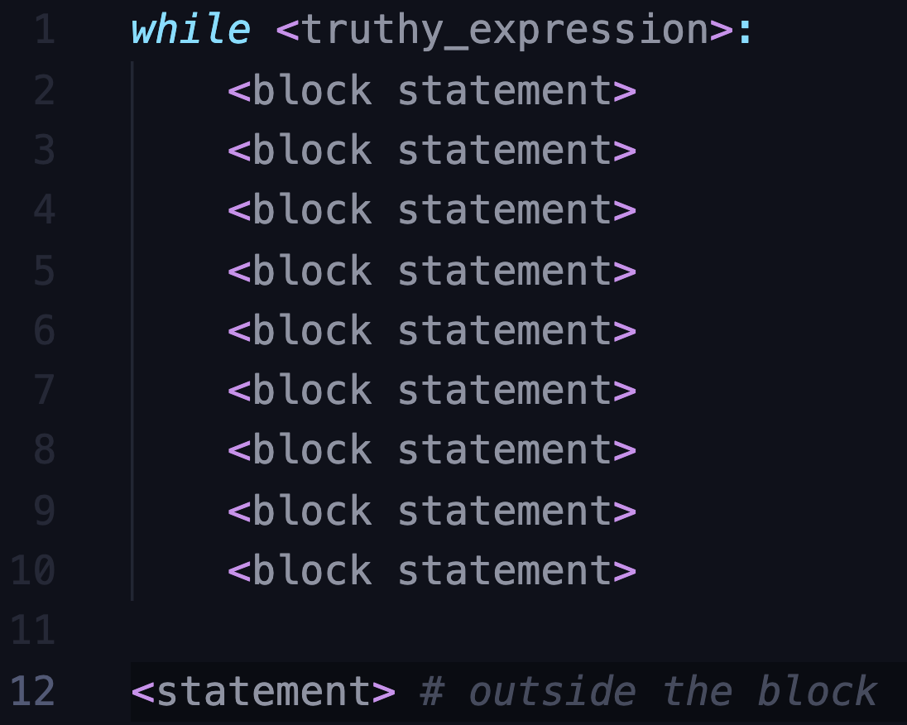
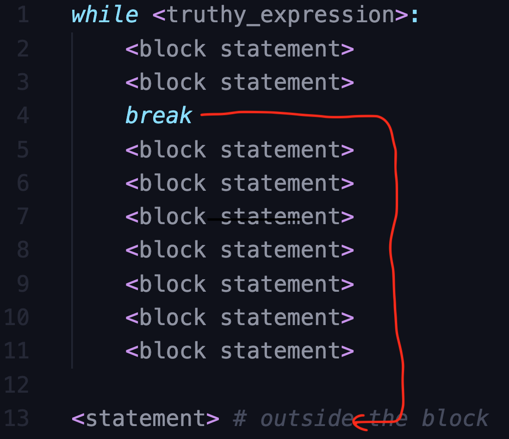
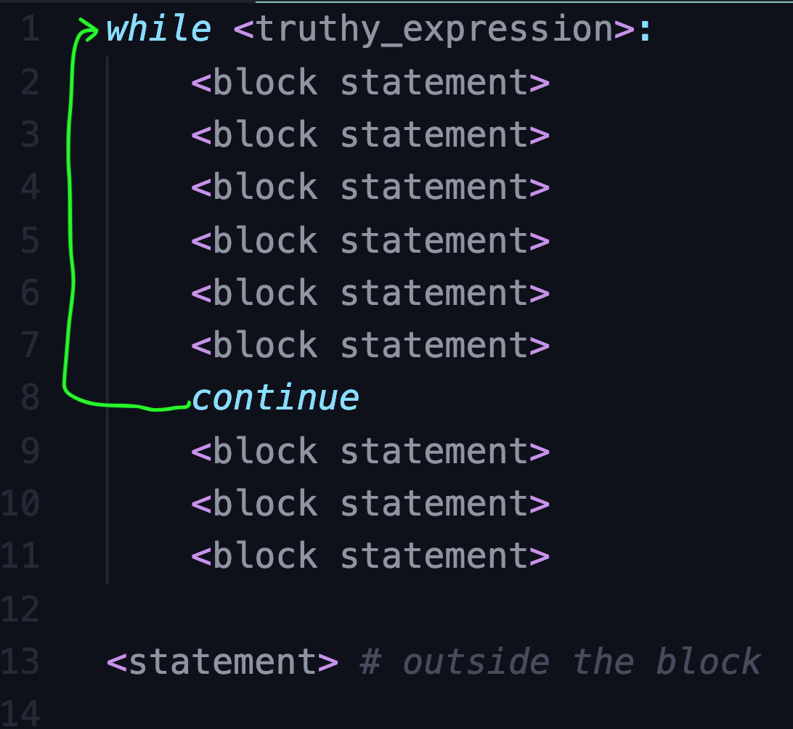

# Loops: Outline

## Intro

- `print("hello")` 5 times in REPL
- Doing the same thing is boring (sheep counting/ number counting to sleep)
- `print(1)` up to 5 in REPL - boring!
- You as a python developer don't have to repeat - thanks to loops

- Use the for loop - point out the indentation

  ```python
  for x in range(0,5):
  	print("hello")
  ```

- Point out how much simple and less boring it is.

- Python provides two kinds of loops

  - the `while` loop
  - the `for` loop

  We will look at each in detail


Some basic definitions and concepts before we look at loop in detail

#### Iteration:

- executing same block of code over and over. Implemented using a programming structure called loop

#### Indefinite iteration:

- number of times not known in advance. Do till some condition is met
- This is potentially a `while` loop

#### Definite iteration:

- number of times to loop is known before the loop starts
- This is potentially a `for` loop

## While loops

```python
	while <expr>:
		<statement(s)>
```

- Block executed till the expression is true (boolean context). The block is not new... we have seen this in `if`. You should refer back to it in case you need to.
- The block is called the **Loop body**.
- if true execute the body and then back again to check if it is true and if so execute the body again and so on till the expression is false. Once it is false, the flow moves to next statement outside the block
- Expression generally will contain a variable defined before the loop and changed in the body of the loop so that the condition becomes un true at some point. Otherwise we will never stop and that is not a good thing...
- Example: a simple count down

```python
>>> c = 5
>>> while c > 0:
...     print(c)
...     c -= 1 # If you miss this line then the program will never stop.
5
4
3
2
1
```

- The controlling expression is tested first. So if it is wrong in the beginning itself then the loop body will not be executed at all. *Show the value of `c` and run the loop again and show`
- A while loop looks for boolean condition - Another example:

```python
# while_repeater.py
what_you_said = "start"
while what_you_said != "done":
    what_you_said = input("Say something: ")
    print("You said: " , what_you_said)
```

### Python `break` and `continue` Statements

- Usually the entire body of the loop is executed. Can we avoid that?
- The `break` allows to terminate the entire loop/iteration. Multiple `break` statements in the body possible
- The `continue` skips the current iteration or loop

#### Deep dive

The normal while loop



Let us look at some code:

```python
# while_fruits.py
fruits = ['apple', 'apricot', 'banana', 'chickoo', 'fig', 'guava', 'mango', 'orange']
while fruits:
    fruit = fruits.pop()
    print("I love", fruit)

```

output:

```shell
I love orange
I love mango
I love guava
I love fig
I love chickoo
I love banana
I love apricot
I love apple
```

##### The `break`

Let us introduce the `break` now:



The code:

```python
# while_fruits.py - break
fruits = ['apple', 'apricot', 'banana', 'chickoo', 'fig', 'guava', 'mango', 'orange']
while fruits:
    fruit = fruits.pop()
    if fruit == 'chickoo':
        print(fruit, "! Yuck... I have had enough")
        break
    print("I love ", fruit)
```

output:

```shell
I love orange
I love mango
I love guava
I love fig
chickoo ! Yuck... I have had enough
```


##### The `continue`

The `continue` is different. Let us look at a picture



And now some code

```python
# while_fruits.py - continue
fruits = ['apple', 'apricot', 'banana', 'chickoo', 'fig', 'guava', 'mango', 'orange']
while fruits:
    fruit = fruits.pop()
    if fruit == 'banana':
        print(f'Let us skip {fruit}')
        continue
    print(f"I love {fruit}")
```

Output

```shell
I love orange
I love mango
I love guava
I love fig
I love chickoo
Let us skip banana
I love apricot
I love apple
```

##### The `else` clause - *We won't cover this*

- `while` with else is generally not available in other languages. It is rarely used so I am not covering it reduce the things which you need to keep in mind.

### Infinite Loops

- `while True:`

```python
>>> while True:
...     print("going on...")
```

- Run forever... Terminated by `Ctrl + C` - KeyboardInterrupt
- This looks like something you would not want to do - who will? - but it is very common - services that start up to serve requests forever till want to shut things down.
- Also there is the `break` statement as well that can help.
- An example:

```python
# while_repeater.py - break
while True:
    what_you_said = input("Say something: ")
    print("You said: " , what_you_said)
    if what_you_said == "done":
        break
```

output:

```shell
Say something: Hi!
You said:  Hi!
Say something: How are you?
You said:  How are you?
Say something: !Super!
You said:  !Super!
Say something: done
You said:  done
```

### Nested while loops

- loop within a loop

```python
while <expr1>:
	statement
	statement
	while <expr2>:
		statement
		statement
```

- example

```python
#while_icecream_flavors.py - nested loops
icecream_flavors = ['vanilla', 'chocolate', 'strawberry', 'mint chocolate'
    , 'chocolate chip', 'cookie dough']
fruits = ['apple', 'apricot', 'banana', 'chickoo', 'fig', 'guava', 'mango', 'orange']
flavor_index = 0
print('The combinations are:')
while flavor_index < len(icecream_flavors):
    fruit_index = 0
    flavor = icecream_flavors[flavor_index]
    flavor_index += 1
    while fruit_index < len(fruits):
        fruit = fruits[fruit_index]
        fruit_index += 1
        print(f"{flavor} - {fruit}")
```


- `break` or `continue` applies to the nearest enclosing loop

```python
while <expr1>:
	statement
	statement
	while <expr2>:
		statement
		statement
    break
  break
```

- example with continue

```python
#while_icecream_flavors.py - nested with continue
icecream_flavors = ['vanilla', 'chocolate', 'strawberry', 'mint chocolate'
    , 'chocolate chip', 'cookie dough']
fruits = ['apple', 'apricot', 'banana', 'chickoo', 'fig', 'guava', 'mango', 'orange']
flavor_index = 0
print('The combinations are:')
while flavor_index < len(icecream_flavors):
    fruit_index = 0
    flavor = icecream_flavors[flavor_index]
    flavor_index += 1
    while fruit_index < len(fruits):
        fruit = fruits[fruit_index]
        fruit_index += 1
        if fruit == 'banana':
            continue
        print(f"{flavor} - {fruit}")
```


- You can nest other control statements like `if` , `else` and `elif`

=======================================================================

## For loops

- For loop provides support for *definite* iteration
- Python supports collection/iterator based loop. It does not support other types:
  - numeric range loop
  - three expression loop (init, end condition, end of iteration action)

```python
for <var> in <iterable>:
	<statement(s)>
```

-  iterable is a like a collection of objects - list or tuple
- the body executed once per item of the iterable
- `var` contains the next element

```python
>>> fruits = ["apple", "banana", "chickoo"]
>>> for fruit in fruits:
...     print(fruit)
```

- Let us dive deeper into iterables / iterators

### Iterables

- **iterable** means an object can be used in iteration (repeated execution of a set of statements is called **iteration**)
- if an object is iterable then it can be passed to `iter()` built-in that returns an *iterator*

```python
>>> iter('dingdongbell') # string
<str_iterator object at 0x1104f5c70>

>>> iter(['ding', 'dong', 'bell']) # list
<list_iterator object at 0x11078b8e0>

>>> iter(('ding', 'dong', 'bell')) # tuple
<tuple_iterator object at 0x10fff5070>

>>> iter({'ding', 'dong', 'bell'}) # set
<set_iterator object at 0x110988c40>

>>> iter({'ding': 4, 'dong': 8, 'bell': 12}) # dict
<dict_keyiterator object at 0x1104d8ef0>

>>> iter(44)
Traceback (most recent call last):
  File "<stdin>", line 1, in <module>
TypeError: 'int' object is not iterable

>>> iter(2.2)
Traceback (most recent call last):
  File "<stdin>", line 1, in <module>
TypeError: 'float' object is not iterable

>>> iter(len)
Traceback (most recent call last):
  File "<stdin>", line 1, in <module>
TypeError: 'builtin_function_or_method' object is not iterable
```

- many object in python are iterable - open files. You could make your own too... may be later...

### Iterators

- iterator can be used for iteration
- iterator is a value producer that yields successive values from its iterable
- use `next()` to get the the next value

```python
>>> fruits = ["apple", "banana", "chickoo"]
>>> fruit_itr = iter(fruits)
>>> fruit_itr
<list_iterator object at 0x10d627220>
>>> next(fruit_itr)
'apple'

>>> next(fruit_itr)
'banana'

>>> next(fruit_itr)
'chickoo'
```

- Iterator manages its own state - next function return the next value
- What happens when you try again - `StopIteration` Exception is raised.

```python
>>> next(fruit_itr)
Traceback (most recent call last):
  File "<stdin>", line 1, in <module>
StopIteration
```

- One way flow - you can't go back. no `prev()`
- Multiple iterators for the same iterable are possible and each manages its own state.
- It is possible to create your own interator in Python - that is advanced and something we might cover some other time.
- Now let us get to the python `for` loop

### The innards of the Python `for` Loop

- Iteration : porcess of looping through items/objects in a collection
- Iterable : an object that can be iterated over
- Iterator: the object that produces successives items from its associated iterable
- `iter()` : The built-in function used to obtain an iterator from a iterable

```python
>>> fruits = ["apple", "banana", "chickoo"]
>>> for fruit in fruits:
...     print(fruit)
```


- A for loop does:
  - calls `iter()` to get an iterator
  - calls `next()` repeatedly
  - The loop body is executed once for each item next() returns, with loop variable `fruit` set for each iteration
  - terminates/stops loop once `next()` raises the `StopIteration` exception
- Seems a lot of work but it is kind of generic and hence useful. One concept that applies everywhere makes it simple. This is called making thing reusable. We will talk more about reusability in a different session.
- Python has a lot of built-in and library objects that are iterable
- User defined objects created in Python can be made iterable
- List iteration is very simple as we have seen above. Let us look at a dict

### Iterating Through a Dictionary

- Iterating through a dictionary iterates over the keys of dictionary

```python
>>> fruit_basket = {"apple": 3, "banana": 4, "chickoo": 3}

>>> type(fruit_basket)
<class 'dict'>

>>> for fruit in fruit_basket:
...     print(fruit)
apple
banana
chickoo
```

- access values as usual

```python
>>> for fruit in fruit_basket:
...     print(fruit, "of quantity:" ,fruit_basket[fruit])
apple of quantity: 3
banana of quantity: 4
chickoo of quantity: 3
```

- If you want to directly iterate over dictionary values then use the function `values()` of dict.
- You can even iterate over both keys and values simultaneously since the loop variable in a loop isn't limited to a single variable. It can be a tuple and you can use tuple unpacking. We have seen tuple unpacking when we discussed tuples. I will just do a simple example to refresh your memory

```python
>>> x, y = (1,2)
>>> x
1
>>> y
2
```

- Now let us see how to use tuples in a for loop with unpacking

```python
>>> for x, y in [(1, 2), (3, 4), (7, 8), (6, 9)]:
...     print("x is:", x)
...     print("y is:", y)
```

- dictionary key value pairs or items can be obtained using the dict method `items()` - they return items which are effectively tuples

```python
>>> for fruit, quantity in fruit_basket.items():
...     print(fruit, "of quantity:" ,quantity)
apple of quantity: 3
banana of quantity: 4
chickoo of quantity: 3
```

### The `range()` Function

- We started with wanting to print things 5 times.
- Since python supports only one kind of `for` loop we can do this to iterate through values 0 to 4:

```python
>>> for i in (0, 1, 2, 3, 4):
...     print(i)
```

- This is ok for small numbers, but if the range is big then what.
- Of course python has an answer. the built-in `range()` function
- `range()` returns an iterable which yields a sequence of integers starting from 0 but including the value provided to range
- `range(5)` gives an iterable of 0, 1, 2, 3, 4 values. We can see this by by doing this:

```python
>>> list(range(5))
[0, 1, 2, 3, 4]
```

- `range` does not return a list or tuple. It actually returns an iterable.
- `range` can also have <begin>, <end> (this we know), <stride>. All the parameters must be integers (positive or negative). But we need to take care of the signs so that we know the loop actually ends...

### Altering `for` Loop Behavior - `break` and `continue`

- Similar to `while` , `for` loops can also `break` or `continue`
- `break` terminates loop completely and moves on

```python
>>> fruits = ["apple", "apricot", "banana", "blueberry", "chickoo"]
>>> for fruit in fruits:
...     if "ban" in fruit:
...         break
...     print(fruit)
apple
apricot
```

- `continue` terminates the current iteration alone

```python
>>> fruits = ["apple", "apricot", "banana", "blueberry", "chickoo"]
>>> for fruit in fruits:
...     if "ban" in fruit:
...         continue
...     print(fruit)
apple
apricot
blueberry
chickoo
```

### Nested For Loop

- An example

```python
#for_icecream_flavors.py
icecream_flavors = ['vanilla', 'chocolate', 'strawberry', 'mint chocolate'
    , 'chocolate chip', 'cookie dough']
fruits = ['apple', 'apricot', 'banana', 'chickoo', 'fig', 'guava', 'mango', 'orange']
print('The combinations are:')
for flavor in icecream_flavors:
    for fruit in fruits:
        print(f"{flavor} - {fruit}")
```

##### The `else` Clause - Not covering

- Not very useful or intuitive to understand. Best to not use it.

## Problem

### Guess a number?

Build a simple game: The program randomly picks a number between 1 - 100. The user has 10 guesses. At each guess the program should tell if the user’s guess is lower or higher than the picked number. If the user finds the number say ‘Hurray’. If the 10 tries are complete then say ‘Sorry’ and tell the picked number. After either come out of the program.