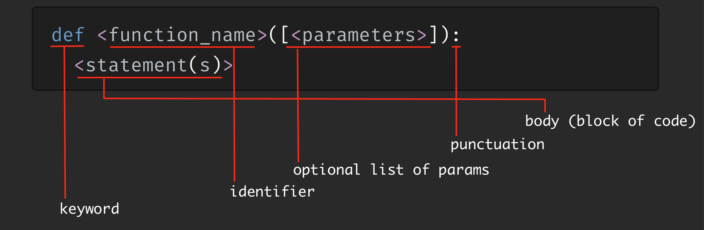

# Functions, Modules & Packages: Modularity in Python

Till now we we have been using functions (built-in). Now let us create some or in developer language - *define* functions

## Functions in Python

- Every language supports both usage and definition of functions.
  
- Functions are chunks of code that tell Python to do something. They are one way to reuse code - you can use functions in your programs again and again.
  
- Let me define a function in a more developer like language: A function is a self-contained block of code that does a task (encapsulates a task) or a related group of tasks.
  
- We have seen a lot of built-in functions - `id(), len(), any(),` \- the code for this resides somewhere - you don't know where or even how it works. All you need to know is how to call it using it's **interface**:
  
    - arguments it takes
    - values it returns
    
    And remember both could be empty.
    
- When you call a function, the program execution goes to the function (along with anything that you may send with it), which does its task (hopefully something useful) and returns back to where it was called from and starts off where it left. Of course, the function may return back some data but it is not necessary.
  
- A function defined by you works the same way. You call it, it gets executed and the control returns back. Of course since you wrote it you know where it is and how it does something.
  

### The Importance of Python Functions

- All languages support functions. They may be called differently in different languages.
- Some common `function` synonyms - *Subroutines*, *Procedures*, *Methods*, *Subprograms*

Before we figure out how to define them, let us understand why define them? (Why is always the most important question - we forget it most of the time and keep focusing on how). I had given a hint of why we define them before but let us dig in deeper.

#### Abstraction and Reusability

You write some useful code - say how to calculate compound interest or find out all the prime numbers from 0 to a given number. As you keep writing more and more programs, you might want to do that particular task again. So you copy and paste that code in another part of the program. Problem solved. You keep doing this for sometime.

Now you want to change that task slightly. Say apart from return positive prime number you want it to return negative ones also. What do you do? You find all the places this code was written and change it everywhere... How boring is this? Also what if you miss it in one case - Now you have a bug ( a mistake in developer language)!!!!

Instead you can define a function which does this work - let us call it `findPrimeNumbers` . Once you define this function in one place, you can call this everywhere and the same code will execute. When you want to make a change to return negative prime numbers, you just have to change the one place - the function and you are done!!!! Wherever you wanted work in the new way! How cool is that?

This taking out of functionality - also called *abstraction of functionality* \- into a function is a very powerful thing. It allows us to follow a software development principle `DRY - Don't Repeat Yourself` . Aren't you convinced that functions are the best thing in the world. This one reason is good enough for me. But there is more.

#### Modularity

Functions allow breaking things down into small manageable pieces. Let us say you are building this program which takes a lot of input from the user, does a lot of calculations and then prints out all the results to the user. You could write that program like this:

```python
# Main program

# code to collect input from the user
<statement>
<statement>
<statement>
<statement>

# do the calculations
<statement>
<statement>
<statement>
<statement>
<statement>

# print the result
<statement>
<statement>
<statement>
<statement>

```

We have a long line of statements here. In order for us to help understand the code, we used comments and added some extra lines etc. These are good methods but as you keep growing the program it won't be as easy.

A better solution would look like this:

```python
def take_user_input():
    <statement>
    <statement>
    <statement>
    <statement>

def do_calculations():
    <statement>
    <statement>
    <statement>
    <statement>
    <statement>
    
def print_results():
    <statement>
    <statement>
    <statement>
    <statement>

# Main program
take_user_input()
do_calculations()
print_results()
```

This is called **modularized** code. Instead of writing line after line of code, which means we have to read it like that as well, we have split it up small & focused functions which do one thing. The names of the functions tell you what they do as well. And the main program is a simple 3 liner just calling the functions. When you read this code, you start by reading the main program and the 3 lines give you a very good idea what the whole program does at a high level. Then you dive deeper into each function to know more. This kind of reading is also called top down. And each function doing one thing is called Single Responsibility Principle (SRP) - you will definitely come across it down the line in your developer journey.

You might have noticed the `def` keyword. It is used to define functions... More coming soon.

The idea of splitting work up into steps is not something new. You surely do it all the time. Think about how you get your bag ready for school...

- Take out books from the bag
- Look at the time table
- Arrange the required text books into the bag
- Arrange the required note books into the bag
- Check and arrange your pencil box/bag into the bag.

... you are done

Breaking a big daunting task into small chunked sub-tasks make its easier to think about and manage. Same applies to programs.

#### Namespace Separation

A *namespace* is a region of your program in which any defined variable idenfiers have a connection and a meaning. Let me explain that. In a normal program there is that one namespace which is the program itself. We could call it `main` or `global` namespace for convenience. When you define a function, what you are doing is creating a separate region or namespace and it is separate from the main program. A variable defined inside this namespace is understood by the function and is not confused with same named variable defined in other namespaces (like the main program namespace).

This means that within a function you can define variables with whatever names you want without worrying about if the same name is used to define any function outside. Let me show you an example:

```python
>>> a = 12
>>> def fn1():
...     a = 22
...     print(a)
>>> print(a)
12
>>> fn1()
22
>>> a = 32
>>> print(a)
32
>>> fn1()
22
```

So functions give you more freedom and help reduce unnecessary and unexpected errors.

Hope you are convinced at least now that functions are very useful and also pretty cool!

### Function Calls & Definition

Now let us get into the how part. How does a function look like:



- `def` is a keyword that tells python that a function is getting defined
- Anything you declare or define needs a name so that you can use it or call it later... And function is no different. So it needs a name and that needs to be a valid python identifier. Refer to my previous sessions to figure out what those rules are. Or you could just *search* it on the internet.
- Parameters are part of the definition and tells python that this function can receive data in the form of these parameters. Functions can also be defined without any parameters. That is why it is called *optional*. Alternatively functions can have one or two or three or many (any number) of parameters.
- `:` \- We know this one. We have used it to demarcate the beginning of blocks in `if` statement, `for` statement etc. Since function is also defining a block of code (potentially reusable), the same *punctuation* is used to define the function . Everything before the `:` is considered the header of a function or the signature of the function. Any thing after that, which is *indented* in, is considered the body of the function.
- Last but not the least is the body of the function itself. All the stuff we did above is to get this part written. This is where the work gets done and the header is more about the way outside people see the function. So the body is like the internal organs which is covered by the outside interface or header which is used to call the body of code or block of code. Examples will help:

```python
# Some examples
>>> def factor(dividend, divisor):  # A function definition with 2 parameters
...     print(f"finding if {divisor} is a factor of {dividend}") # Notice the identation
...     remainder = dividend % divisor # using mod '%' operator
...     return remainder == 0

>>> def greeter(): # A function definition without any parameters
...     print("Hello there!")
```

Enough of the definition. Let us talk about the mechanism of how a function is called:

```python
<function_name>([arguments])
```

- Arguments refer to the data we (the caller) want to send to the function. They correspond to the parameters present in the function definition. If a function is defined to accept 2 parameters then when we call the function, we send 2 arguments to it. This is the normal case - there are special cases some of which we will cover later.
  
- If your function definition does not specify any parameters then no arguments are passed. But when you call the function, you still need to add the two paranthesis.
  
    Let us try calling the functions we defined earlier.
    

```python
# Some examples
>>> factor(20,10) # A call to a function with 2 arguments which takes 2 parameters
finding if 10 is a factor of 20
True
>>> greeter() # A call to a function defined with no parameters. Notice the paranthesis.
Hello there!
# If you try to call function without paranthesis
>>> greeter
<function greeter at 0x10ca80d30>
# Actually the call did not happen. Python just thought you wanted to know what greeter is
# and told you that it is a function.
```

- You can define functions in python files as well. When you define such functions, use spaces and empty lines to make the code more readable. For example a line between two functions is surely helpful.
- For writing good clean python code there is a PEP called PEP 8. Check it out when you have the time.

### Argument Passing

You can use functions with or without parameters. But functions taking arguments generally are useful since they can change behavior or manipulate the data passed that will be of help to us. So let us look at that.

#### Positional Arguments

Positional arguments are called with that name because they are based on position of how they are defined as parameters and how they are sent as arguments. So the first positioned parameter in the definition is filled by the first positioned argument. We will be able to understand with an example.

Let us take the previous example and let us define this into a python file:

```python
#basic_fns.py
def factor(dividend, divisor):  # A function definition with 2 parameters
    print(f"finding if {divisor} is a factor of {dividend}") # Notice the identation
    remainder = dividend % divisor # using mod '%' operator
    return dividend % divisor == 0

val = factor(20,10)
if val:
    print("10 is a factor of 20")
else:
    print("10 is NOT a factor of 20")
```

When defining parameters for a function, python pretty much treats these parameters as variables but these variables belong to the namespace of the function. This is also referred to as scope. We call it the local scope and hence these parameters and other variable defined inside the function are called locally defined variables.

In this case we are passing two arguments and python basically does something like this internally as the first step inside the function:

```python
#basic_fns.py
dividend = 20
divisor = 10
# delete the lines after explanation
```

We don't have to write this code. Python does it automatically and now these two variables are available locally for use. And the function body is using it as well. You can see that.

Notice the point above about assignment. I am going to repeat this again. Python takes the first argument and assigns it to the first parameter and second argument to the second parameter. If there were more arguments and parameters then the same thing would have continued. So the order of how the arguments are passed is important. Let me demonstrate this by calling the function again but with a slight difference:

```python
#basic_fns.py
def factor(dividend, divisor):  # A function definition with 2 parameters
    print(f"finding if {divisor} is a factor of {dividend}") # Notice the identation
    remainder = dividend % divisor # using mod '%' operator
    return dividend % divisor == 0

val = factor(10,20) # <- We changed the order of the arguments passed.
if val:
    print("10 is a factor of 20")
else:
    print("10 is NOT a factor of 20")
```

Let us check out the response:

```shell
▶ python basic_fns.py
finding if 20 is a factor of 10
10 is NOT a factor of 20
```

The first line of the output tells you that everything went wrong. The function is trying to determine if 20 is a factor of 10. It will obviously return false. So if you want the function to work correctly when passing positional arguments the argument order is important.

--

What happens if we send only one argument? I am going to use the same function but now I will move to REPL.

First I will define the function in the REPL and then call it in different ways:

```python
# copy from file and paste into REPL 
>>> def factor(dividend, divisor):  # A function definition with 2 parameters
...     print(f"finding if {divisor} is a factor of {dividend}") # Notice the identation
...     remainder = dividend % divisor # using mod '%' operator
...     return dividend % divisor == 0

>>> factor(20,10) # This is a normal call
finding if 10 is a factor of 20
True
# Now you call a function which takes more parameters with less arguments
>>> factor(20)
Traceback (most recent call last):
  File "<stdin>", line 1, in <module>
TypeError: factor() missing 1 required positional argument: 'divisor'
```

As you see above we cannot skip arguments. If you do python will not like it and it will throw an error or exception. That is why positional arguments are also known as required arguments.

So we need to maintain the number and order of arguments if we want to pass them positionally. And that is why it is called positional arguments. The position matters.

This feels very stringent and inflexible. But is also obvious and straight forward. But python always likes to give you more options so that we can find what works for you at different times. So let us look at some of the other flexible and relaxed ways next.

#### Keyword Arguments

Now let us look at a different style of passing arguments. Remember, the way you define parameters is still the same. The difference here is in the way you call the function, the way you pass arguments.

The style which I am going to demonstrate now is called *Keyword Arguments* passing. In this a call to a function is done by specifying arguments in form <keyword>=<value>. The <keyword>must match the name of parameter in the function definition. Let us look at an example in the REPL.</keyword></value></keyword>

I will first define the factor function again in the REPL so that I can use it:

```python
def factor(dividend, divisor):  # A function definition with 2 parameters
    print(f"finding if {divisor} is a factor of {dividend}") # Notice the identation
    remainder = dividend % divisor # using mod '%' operator
    return dividend % divisor == 0

  # Now I call the function using Keyword Arguments
>>> factor(dividend=20,divisor=10)
finding if 10 is a factor of 20
True

>>> factor(dividend=20,divisor=3)
finding if 3 is a factor of 20
False
```

That works as expected and it is really more readable. Of course for a lazy person like me typing that extra keyword name is bit hard ;-)

That is not the only problem. Let me show you something:

```python
# keyword mismatch
>>> factor(dividnd=20,divisor=3)
Traceback (most recent call last):
  File "<stdin>", line 1, in <module>
TypeError: factor() got an unexpected keyword argument 'dividnd'
```

I had earlier told that keyword should match the name of the parameter. Here I made a mistake deliberately to get the keyword name wrong and python immediately complains. The fact is that we could easily make this kind of mistake in normal course of action. The good thing though is that Python complaint is very clear. It names the function and also the name of the wrong keyword. So I can easily correct it.

```python
>>> factor(dividend=20,divisor=3)
finding if 3 is a factor of 20
False
```

Now that I told you how to use keyword arguments you might be thinking what is the big deal. Actually it seems a little more work as well. I will show you the power of this:

```python
>>> factor(divisor=5, dividend=20)
finding if 5 is a factor of 20
True
```

What I did here was change the order of arguments completely. Yet the function worked perfectly. This is the flexibility that keyword arguments offer. You don't have to worry about order of arguments. This might seem trivial for this function. So let me give you an example which takes many more parameters:

```python
>>> def cinema_scene(hero, villian, location, time, herione):
...     print(f"{herione} fought with {villian} in the {time} at the {location} to save {hero}")
```

Now it is very difficult for me to remember the order of parameters needed. So I will obviously prefer to use the keyword method:

```python
>>> cinema_scene(hero="Ajay", herione="Sunita", villian="Gangu", time="night", location="mou
... ntain")
Sunita fought with Gangu in the night at the mountain to save Ajay
```

You can clearly see the order of arguments is completely different from order of parameters in the definition. By because the keywords match the name of parameter Python is able to figure out and make the function work correctly. If I remove the keyword, python will obviously use positional arguments. Let us see the result of the same:

```python
>>> cinema_scene("Ajay", "Sunita", "Gangu", "night", "mountain")
mountain fought with Sunita in the night at the Gangu to save Ajay
```

That is completely ridiculous ofcourse. So you see the keyword arguments do make life easy for us so that we don't have remember the order. So for the amount of work you put in typing you reduce the effort in thinking and remembering. I feel that is a reasonable trade-off. What do you think?

One thing to note is that while keyword arguments take care of us in terms of not having to remember the order, you still have to maintain the number of arguments - that should match the number of defined parameters. Let us take a look:

```python
# removed one argument the last one
>>> cinema_scene(hero="Ajay", herione="Sunita", villian="Gangu", time="night")
Traceback (most recent call last):
  File "<stdin>", line 1, in <module>
TypeError: cinema_scene() missing 1 required positional argument: 'location'
```

There you go. That is not allowed. So keyword arguments allow flexibility of order but not the number of arguments.

Now you can actually mix and match positional arguments with keyword arguments. If you do that you need to take care that all positional arguments come first and keyword arguments are put at the end. I am not going to show this since I feel this is more confusing than required and I don't see it useful in most cases. If you really need it then you can figure it out later.

Now let us see how Python can make life even more easy for the function users.

#### Default Parameters

When it comes to functions with lot of parameters, it is surely helpful to use keyword arguments. But the caller of the function has to still do a lot of work. Can I make the caller's life easier?

Enter *default parameters*! In the definition of a function, if we specify the parameter in the form of `<parameter_name>=<value>` , then the value defined in the signature becomes the default value of the parameter. Let me show this with an example:

```python
>>> def cinema_scene(hero="him", villian="him", location="hill", time="night", h
... erione="She"):
...     print(f"{herione} fought with {villian} in the {time} at the {location}
... to save {hero}")
```

Once I define it this way I can call it like this:

```python
>>> cinema_scene()
She fought with him in the night at the hill to save him
```

Woah! As a caller I did not even have to provide one parameter. That is why default parameters are also called as optional parameters. You can chose to not provide the value of that parameter as an argument or you could if you want to. It is not mandatory but optional. Such a great thing for the caller right!

You could ask me: why I should make the caller's life easier? When you define the function you obviously have to do a little more work. The thing is that most times you will be the one calling this function from other parts of the code. So you will be the one who benefits in many number of cases! That is the beauty of a defined function. Anybody including You can use it. And so making it easy to use is a good thing for you.

Default parameters don't mean that it is all or nothing. You can pick and chose. Let us look at our example. You might want to actually want to control some parts. Like decide what the hero and herione's names are:

```python
>>> cinema_scene(hero="Ravi", herione="Rani")
Rani fought with him in the night at the hill to save Ravi
```

That is cool right! Using keyword arguments combined with default parameters, I am able to get enough change in the behavior of the function as I need. You can also pass arguments in positional style. Let me try that:

```python
>>> cinema_scene("Ravi","Rani")
She fought with Rani in the night at the hill to save Ravi
```

This output is slightly different. That is because in terms of position of parameters in the function definition or signature, the first belong to the hero and second to the villian. So that got changed. If I want to change the name of the herione also what should I do:

```python
>>> cinema_scene("Ravi","Raja",herione="Rani")
Rani fought with Raja in the night at the hill to save Ravi
```

So I used a combination of positional arguments and keyword arguments to get what I want. You can do the same too. Play with both definition of functions and calling of functions to learn more.

With default parameters there are two thing to note:

- You don't have to provide a default value to all parameters. For some parameters there may not be a good default value. So you are define them without any default. A quick example:
  
    ```python
    >>> def cinema_scene(hero, villian, herione, location="hill", time="night"):
    ...     print(f"{herione} fought with {villian} in the {time} at the {location}
    ... to save {hero}")
    
    >>> cinema_scene("Ravi","Raja","Rani")
    Rani fought with Raja in the night at the hill to save Ravi
    >>> cinema_scene("Ravi","Raja")
    Traceback (most recent call last):
      File "<stdin>", line 1, in <module>
    TypeError: cinema_scene() missing 1 required positional argument: 'herione'
    ```
    
    Here I have not defined default parameters for `hero`, `herione` and `villian` parameters. If you don't pass one then python will give an error. Or we can say that the function will through an error. Also note that if we are going to have some optional arguments and some mandatory arguments then all optional arguments should be at the end. This is mandated by python so that things are explicit and straight forward to understand when we mix and match arguments.
    
- The second thing to keep in mind is that if you are going to provide default values to some parameter let the parameter data type be immutable. That is let it be values of type string, integer etc. Don't use mutable types like list, set etc. in default values. That can give you unexpected results. I won't go into details on this one since it is more complex and will take us away from the main things we are trying to learn. You can try to play with it and find more.
  

In summary, we have covered a lot of ground of parameter defintion and calling with arguments. We looked at positional arguments, keyword arguments and default parameters. Next we will look at ...

#### Pass-By-Value vs Pass-By-Reference in Python

We saw the entire concept of passing arguments to functions which are used as parameters inside the function. There is related concept you need to learn regarding how this happens. Let us look at our factor function in a new file:

```python
#pass_by.py
def factor(dividend, divisor):  # A function definition with 2 parameters
    print(f"finding if {divisor} is a factor of {dividend}") # Notice the identation
    remainder = dividend % divisor # using mod '%' operator
    return dividend % divisor == 0

x = 30
y = 3
z = factor(x, y)
print(z)
```

Let us call the function:

```sh
▶ python pass_by.py
finding if 3 is a factor of 30
True
```

Here, a couple of variables are defined in the main program. These are then passed as arguments and the function uses these to do some work. The question is how are they passed. Are they passed as variables or data or something else? This question probably confuses you. So let us take a different example to understand:

```python
#pass_by.py
def doubler(input):
    print("Inside the function", input)
    input = input * 2
    print("Inside the function after doubling", input)

x = 20
print("Inside main before function call", x)
doubler(x)
print("Inside main after function call",x)
```

So we have written a doubler function which doubles the input and sets the value to the input. We also print the values

- both inside the function and outside the function - which is called main (signifying it is the main program) and
- also before and after the actual doubling operation.

Now what do you expect the output to be. Before you run this program (or proceed with the video) first take sometime to guess the output and note it down. Here is the actual output:

```
▶ python pass_by.py
Inside main before function call 20
Inside the function 20
Inside the function after doubling 40
Inside main after function call 20
```

Did you expect that? So what happened here?. We see that we passed the value to the function. The function changed the value. But when we print the value again in the main program nothing had changed. So the `doubler` function failed in its job. Why did this happen?

This phenomenon is called *passing by value*. In pass by value, a copy of the argument is passed to the function. Since the function gets a copy of the data stored in the caller, it can’t modify the original value in the calling environment.

With this, can we conclude that Python passes arguments by value. Not so fast. Let us try a different example:

```python
#pass_by.py - write the code
def doubler_again(input):
    print("Inside the function", input[0])
    input[0] = input[0] * 2
    print("Inside the function after doubling", input[0])

x = [20]
print("Inside main before function call", x[0])
doubler_again(x)
print("Inside main after function call",x[0])
```

The doubler tries again. Do you think it will succeed? First guess before you run the program (or see the video):

```sh
▶ python pass_by.py
Inside main before function call 20
Inside the function 20
Inside the function after doubling 40
Inside main after function call 40
```

That worked! So this time doubler changed the value inside the function and the outside world (the main program) saw the change. This means that the function did not get a copy of the list but the actual list itself. That is why when we changed the contents it reflected on the outside. This phenomenon is called *pass by reference*.

In pass by reference, a reference to the argument is passed to the function. So any changes the function makes to the corresponding parameter will affect the value in the calling environment. Does that mean python uses pass by reference? In some ways it is true. But let me show you another example:

```python
def doubler_again(input):
    print("Inside the function", input[0])
    input = [input[0] * 2] # This is the line which changed
    print("Inside the function after doubling", input[0])

x = [20]
print("Inside main before function call", x[0])
doubler_again(x)
print("Inside main after function call",x[0])
```

What do you think happens now?

```python
▶ python pass_by.py
Inside main before function call 20
Inside the function 20
Inside the function after doubling 40
Inside main after function call 20
```

Looks like we are back to square one. Now the function could not change the world outside it. If you notice the change this time was to replace the entire list but in the last attempt it was changing only the contents of it. Now that you have seen the examples let me try to explain the theory behind this.

In python all data is actually an object (almost all). An object is a new concept, so I won't get into it in much detail. Think of it like an object which you see in the real world. So it is a thing which occupies some space in the memory of the program. So whether it is simple integer or it is a list or a dict or a string or boolean - they are all objects. We have already seen that variables just give a name to this object. They refer to it. These variables actually store the memory location to the actual object. They don't hold the object itself.

From our perspective, this generally does not make a difference. But it matters in the context of argument passing. What python does is that it copies the memory location present in the passed argument and assigns it to the called parameter. So now inside the function, the parameter holds the memory location (or a reference) to the actual object. So the value was copied (so it is pass by value!), but the value copied was the reference to the actual object (pass by reference!). So python has some kind of mix of these two approaches. It is also called **pass by assignment**.

This might be confusing to you. So instead of going another round of confusing jargon, I will give you a simpler explanation (hopefully) to work with:

- If you pass a immutable object to a function (say integer, string, tuple etc.), the function cannot change the immutable object on the outside - because the object is immutable. So if a integer is passed as argument and in the function code you change it the original value does not change. This variable just refers to a different object. The outside variable still refers to the old object and that cannot be changed.
- If you pass a mutable object to a function (say list, dict etc), the funciton can change the insides of the object using the copied reference. It uses the location to reach out to the object and changes it. So when the control goes back to the main program it sees the changed object. If the function replaces the object entirely, it is just making the parameter (which works like a local variable) point to a new object. The outer world is still refering to the old object. So no matter what changes are there in the new object the outer world will not see it.

This is the crux of how argument passing works in python. Pass a immutable object and you will see that the function cannot affect the outside world with any changes happening inside its code. Pass a mutable object and the function can reach inside and change it and it will be visible to everyone in the world. Hope that helps.

Let us now move on to another related concept.

#### Side Effects

The function changing the input variable in a way that it affects the caller (like in the list case) is called a side effect of a function. Change input variables is just one kind of side effect a function can have. If a function does anything that affects the environment outside it, it is called a side effect. A simple case of writing to a file or even printing a output statement is a case of side effect because it is changing something outside of it and in the environment.

In the real world, we use the term side effect for medicines. The medicine is intended for one purpose but it does other things too. Some cases these can be bad effects but in others these effects can be beneficial.

In the programming world a function can have side effects. There are also functions whose primary purpose is to cause side effects. But side effects are all not good. Most times if the function clearly exposes the side effects by proper names or by proper documentation and the caller is aware of them these effects are mostly beneficial - at least they can be kept in control/check. But if the side effects are not clearly communicated by the function writer and they manifest in unexpected or unknown ways, most times these effects are detrimental to the caller or user of the function.

In some sense this is true with real world medicine as well. If you know the side effects of a medicine you (or your doctor) can create a plan or mechanism to keep things in check. Only when the side effect is unknown or unexpected the problem becomes a real issue. Keep this in mind when working with functions.

### The return Statement

We have been talking about functions and we finished off last time with side effects. We did say side effects are not necessarily a bad thing. But if the changing of the environment is a side effect then what is the main effect. If a function does not have a side effect why would I call a function?

The main effect of function is that it can *return* something. But let us first understand what return means and why would a function want to do it? A function uses the `return` keyword for returning. As the word signifies the `return` statement does two potential things:

- It immediately stops the execution of the function and returns the execution back to the caller. It is return...
- It provides a way to return back data to the caller. As I said *this* is the main effect of the function.

The fact that a function can transform and return some output is generally considered the main purpose of a function. You would surely be writing many functions which return nothing and the only real reason for calling them is their side effect. So from a perspective of getting some work done through the function, the side effect might be the main event we want from the function. But from a perspective of software concepts the function return value is considered the main effect and other environment changes happening inside are called side effects. There is good reason to think like this - main effect or return values lead to explicit and very clearly followable code. Side effects have a tendency to conceal which might turn out to be dangerous (potentially). So a function which doesn't have any side effects is also called a pure function (there is another criteria but this is an important one.)

Now that we know the two purposes, let us dive a bitter deeper into each one of them:

#### Exiting a Function

The first purpose of `return` in a function is exiting the function. Let us take a simple example:

```python
>>> def add(x, y):
...     z = x + y
...     print(z)
...     return
>>> add(2,3)
5
```

So I have used the return statement at the end of the function. And this is supposed to exit the function and it works. But in this case the return statement does not really add much value. Given that the function is going to end just before that, the Python runtime would have anyway returned the control back to the caller. So when does the return really have a value? Let us take a look at another example:

```python
# return.py
def age_commenter(age):
    if age < 0:
        print("Mr Unborn")
    elif age <= 12:
        print("Whizzo Kiddo")
    elif age < 20:
        print("Super Teen")
    elif age < 30:
        print("Vibrant Youth")
    else:
        print("Oldie Moldie")

age_commenter(28)
age_commenter(32)
age_commenter(6)
```

This is our old age_commenter modified slightly and fitted into a function. We can change this slightly and see how it works for us

```python
# return.py
def age_commenter(age):
    if age < 0:
        print("Mr Unborn")
        return
    if age <= 12:
        print("Whizzo Kiddo")
        return
    if age < 20:
        print("Super Teen")
        return
    if age < 30:
        print("Vibrant Youth")
        return
    print("Oldie Moldie")

age_commenter(28)
age_commenter(32)
age_commenter(6)
```

This also works exactly as before. The difference is that I am just using a bunch of `if` statements instead of `elif`s and `else`. This actually is more easy to understand and readable - atleast to me. Each condition lives on its own and does not depend on the other condition. The explicit `return` statement ensure that once a condition is met other conditions are not executed at all. And because of this there is no need for `elif`s. So a return statement will allow us to exit a function anywhere in the body of the function. This can come in very handy to make code simple.

For example if you are trying to do a calculation like simple interest in a function, the first thing you want to do is to ensure that the data that is provided is useful. Let me show you a half example.

```python
# return.py
def simple_interest(principal, rate, term):
    if !type(principal) == int or !type(principal) == float:
        print("Error: Principal has to be a number")
        return
    if !type(rate) == int or !type(rate) == float:
        print("Error: Rate has to be a number")
        return
    #... Do other error checking and validations before doing the 
    # actual thing
```

So in this case I am doing my input checks before I get to the actual calculation. And if inputs don't pass those checks then I print an error and return. This is called input validation and we are doing this error checking right upfront and stopping execution if something is wrong. This is a common style and the `return` 's ability to stop execution anywhere in the function body comes in very handy. Let us now look at the other use of `return`

#### Returning Data to the Caller

As mentioned before the `return` statement can also return back data to the caller. The `return` statement when followed by an expression (statement which evaluates to a value), will return the value of the expression to the caller. We have actually seen this before. Let me show an example:

```python
>>> def simple_interest(principal, rate, term):
...     return (principal * rate * term)/100

```

In this example the `return` keyword is followed by an expression. The value of this expression is returned to the caller and that be used by the caller to do other things. Let us see it in action:

```python
>>> interest = simple_interest(100000, 10, 5)

>>> print("Interest earned: ", interest)
Interest earned:  50000.0
```

So here we have an assignment statement for the variable `interest` and the output or the return of the function is stored in it. `interest` basically represents the evaluation of the function - the main effect of the function. The caller can use it in other expressions too. Let us see an example:

```python
>>> def simple_interest(principal, rate, term):
...     return (principal * rate * term)/100
>>> principal = 100000

>>> amount = principal + simple_interest(principal, 10, 5)

>>> print("Amount obtained: ", amount)
Amount obtained:  150000.0
```

Here the function output is directly used in a expression to find the amount. This works because the function returns something that the caller can work with in its expression. If that changes then let us see what happens:

```python
>>> def simple_interest(principal, rate, term):
...     return "interest: " + str((principal * rate * term)/100) # changed what is returned 

>>> amount = principal + simple_interest(principal, 10, 5)
Traceback (most recent call last):
  File "<stdin>", line 1, in <module>
TypeError: unsupported operand type(s) for +: 'int' and 'str'
```

As you see here, the function evaluation no longer works in the caller's expression (since you are passing a string). So keep this in mind.

A function can return any type of object - integers , strings, lists, booleans, dicts etc. I have shown examples of where float and string are returned. But we can return pretty much any data type.

You can even return multiple items. These are just returned as a tuple and you can use tuple unpacking to get the multiple values. As usual, let me illustrate this with an example:

```python
>>> def simple_interest(principal, rate, term):
...     si = (principal * rate * term)/100
...     amount = principal + si
...     return si, amount

>>> a = simple_interest(20000, 10, 5)

>>> a
(10000.0, 30000.0)

>>> type(a)
<class 'tuple'>
```

As I said before you can use tuple unpacking to get individual values.

```python
>>> si, am = simple_interest(20000, 10, 5)
>>> si
10000.0

>>> am
30000.0
```

Lastly if a function does not return any data - just a plain `return` statement, it actually returns `None` . Let me show you:

```python
>>> def hello():
...     print("hello")
...     return

>>> a = hello()
hello

>>> type(a)
<class 'NoneType'>

>>> a == None
True
```

Removing the return statement in the function will not change anything you can try it out.

#### Looking at Side Effects again

Now that we know all the concepts of returning data in functions, lets us relook at our original doubler function:

```python
>>> def doubler(input):
...     input = input * 2

>>> x = 20

>>> doubler(x)

>>> x
20
```

I have removed all the print statements in the previous example. Now we know this does not work i.e. the caller of doubler does not get a double value. With the things we have learned let us try to change this:

```python
>>> def doubler(input):
...     return input * 2

>>> x = 20

>>> x = doubler(x)

>>> x
40
```

In this case the `doubler` return the doubled data and the caller assigns the value to the same variable. This works and is very clear and explicit. Just like how python likes it. For immutable values this is the only way.

For mutable objects like lists we have seen that we can reach into them and change them from inside the function. That said it is still better to use the *return + assignment* plus assignment technique for that also

```python
>>> def double_list(input_arr):
...     d = []
...     for v in input_arr:
...         d.append(v * 2)
...     return d

>>> a = [2, 3, 5 , 9]

>>> a = double_list(a)

>>> a
[4, 6, 10, 18]
```

With this technique we no longer need to rely on side effects for getting our work done. As I said before side effects are not always bad. They are absolutely needed in some cases. For the above case of list doubling we could use either techniques It is a matter of style. I would prefer the *return+assignment* technique for this. It is my opinion and also suggested by many senior developers. I leave it to you decide.

Now we are done with all that we want to learn about functions. Let us move forward or think bigger.

## Python Modules and Packages – An Introduction

We saw functions earlier as a way to split up code to simplify and make thing reusable. But functions are only the first step. As a developer you will create programs or applications which have 1000s of lines of code. If you working with a team of developers you might have even bigger programs or applications to write and not just one but many. For these reasons we need more ways to break up our programs. Of course python has the answer.

Python modules and packages. In these set of sessions we will try to get a basic understanding of these two mechanisms which allow is to do modular programming.

**Modular programming** is the process of breaking a large program or application work item into separate, smaller, more manageable subtasks or **modules**. Individual modules can be put together like building blocks to create the big application. Modularizing our code helps in many ways. The important ones are:

- Simplifying code - You don't have to think of everything at one shot. (Ok I said something similar to this when I talked about functions. And that is not coincidence. Bear with me). A module focuses on one relatively smaller part of the problem. So you focus on that and get it all working. Easier to do and lesser errors
- Maintainability - Modules are supposed to be logical boundaries. So everything that happens inside is not fully known to others. Others use the module for what it does but they may not know how it does it. If you write your modules this way, there could be many instances where the module can be changed without affecting other parts of the code. That makes the entire code easier to change for upcoming changes - Change is inevitable. So you and others in your team can easily work with a big application without stepping on each others toes.
- Reuse - We already saw how functions can help with reusability. Modules can and are typically a collection of related functions and hence the module itself can be reused in other contexts. No need to duplicate code. Think about built-in modules like `math`
- Scoping - We have already seen how functions can provide a separate region for variables to live. Modules are similar and these regions are called name spaces. Modules will allow you to define variables, functions and other such objects and they live in a separate area from other code. This reduces the chance of name collisions. A `calculator` module can have an `add` function which is separate from the `add` function inside a `online_shopping_cart` module.

So in toto, modules are like functions and so are packages. They help with modularity of code. They are just bigger ;-)

### Python Modules: Overview

3 ways to define a module:

1.  A module written in python.
2.  A module written in C and loaded by python runtime
3.  A built-in module which is already present in the interpreter like `math` and `itertools`

Whatever the case, whatever the kind of module we can use them or access them the same way. And we have seen how to do this already - the `import` statement.

Though there are 3 ways, we will be focusing on the first way. Because we are here to write python code not *C* code. And creating a python module in the first way is very easy.

All you have to do is create a new file and add the code you want (it should be valid python code of course) and name the file with an file extension of `py` . That is it! No abracadabra. As long as it is in the right location, we can start using it. Let us do this

```python
# my_mod.py
hero = "Superman"
pi = 3.14

def hello(name):
    print(f"Hello! {name}!!!!")

def circle_area(r):
    return pi * r * r
```

So my `my_mod.py` module is ready. It has got two variables and two functions. Whatever files we created earlier could also be treated as modules.

In the same folder I am going to open the python REPL (ptpython)

```python
# I import the module
>>> import my_mod

# and I start using the functions
>>> my_mod.hello("Srini")
Hello! Srini!!!!

# And I don't have to stop there. I can even use the varibles defined in the module
>>> my_mod.hello(my_mod.hero)
Hello! Superman!!!!
```

Let us try the other function and variable too... just for variety

```python
>>> my_mod.circle_area(3)
28.259999999999998

>>> (4/3)*my_mod.pi * 3**3
113.03999999999999
```

Lo! Behold! you have created a python module and used it as well. Pay special attention to how I am using it and we will cover it in more detail down the line.

### The Module Search Path

Ok. We created a module and used it. What all modules can you use? How does one figure it out? How does Python know which are modules it can use?

When we write the statement,

```python
>>> import my_mod
```

Python (that is the python interpreter) needs to find this module to import it. Where will it look for it?

- The first place to look for is the current directory. That is the directory where you ran the python program or interpreter. So if you create a module file in the same directory you are running python (which is what you did) then python can pick it up.
  
- The second place for the python interpreter to look at is inside the list of directories mentioned as part of an environment variable called `PYTHONPATH` .
  
    - What is an environment variable? This is more of an OS level concept. It is just a variable that can store some value. That value can be empty too or can be changed. This variable can be accessed by any program running in the system. So the variable is available in the environment of the program. That is why it is called an environment variable. Almost all programming languages provide a way to get hold of these values. And programs also use them.
      
    - In your system, the environment variable `PYTHONPATH` may or may not be defined.
      
    - You can find out by doing this:
      
        ```sh
        # This below technique will work for both linux and macos.
        > echo $PYTHONPATH 
        # for windows:
        > echo %PYTHONPATH%
        ```
        
    - Now in my case it is not set which you might be your case too. If you want to know how the listing will look like, try doing this:
      
        ```shell
        > echo $PATH # or echo %PATH% # this is a different env variable
        /Users/apple/.rvm/gems/ruby-2.5.3/bin:/Users/apple/.rvm/gems/ruby-2.5.3@global/bin:/Users/apple/.rvm/rubies/ruby-2.5.3/bin:/Users/apple/.rvm/bin:/Users/apple/.gvm/pkgsets/go1.11.5/global/bin:/Users/apple/.gvm/gos/go1.11.5/bin
        ```
        
    - If `PYTHONPATH` was set up like this, the python will pick each one of those directories (they are separated by `:` in mac and linux and `;` in windows) and look for a file with that name. If it finds it then it will import that module for you to use.
    
- The last place the python interpreter will look at is a list of directories that are configured as part of the python installation.
  

If you want to know all the places the python interpreter will look at then I will show you a way:

```python
>>> import sys
>>> sys.path
['', '/Users/apple/.pyenv/versions/3.8.1/bin', '/Users/apple/.pyenv/versions/3.8.1/lib/python38.zip', '/Users/apple/.pyenv/versions/3.8.1/lib/python3.8', '/Users/apple/.pyenv/versions/3.8.1/lib/python3.8/lib-dynload', '/Users/apple/.pyenv/versions/3.8.1/lib/python3.8/site-packages']
```

As you can see the current folder is present - denoted by the `''`. The rest of it is coming from the installation. You remember I installed Python 3.8.1 and these are modules installed as part of that installation. Since I have not set anything in the `PYTHONPATH` that is not contributing to it. You can use the `sys.path` to add new folders paths to the lookup directories. But I will not cover that - you could try it if you want.

One last thing: If you want to know from where a module is being loaded from, then you can do this (it works for most modules):

```python
>>> import my_mod

>>> my_mod.__file__
'/Users/apple/other/srini/my_projects/screencasts/code/trials/class-fns/my_mod.py'
# As you can see this is my module and it is coming from the current folder

>>> import math

>>> math.__file__
'/Users/apple/.pyenv/versions/3.8.1/lib/python3.8/lib-dynload/math.cpython-38-darwin.so'
# this is coming from the python installation. You can check the `sys.path` output
```

Now that we know where the python interpreter will look for importing modules, let us get a better understanding of the `import` statement itself.

### The `import` Statement

Importing a module in your code gets you all the stuff inside the module for you to use. But there are many ways of importing modules. Let us start with a basic one:

#### `import <module_name>`

If you remember we said modules provide a namespace for things. So when you import using the above method the namespace is still intact. This method ensures that the module itself can be directly used in the current context but whatever is inside it is not directly available. If this is not clear that is ok. I will give you an example and when we cover other ways of importing things will get clearer.

Let us go back and look at our `my_mod.py` module:

```python
# my_mod.py
hero = "Superman"
pi = 3.14

def hello(name):
    print(f"Hello! {name}!!!!")

def circle_area(r):
    return pi * r * r
```

This is our module. Let us import it

```python
>>> import my_mod
```

Now that you have imported it let us see if you are able to access the contents of the module directly.

```python
>>> hero
Traceback (most recent call last):
  File "<stdin>", line 1, in <module>
NameError: name 'hero' is not defined
```

That did not work. This is what I was saying. The module namespace is still intact with this method of importing. So to use `hero` you have to do this:

```python
>>> my_mod.hero
'Superman'
```

I hope that made better sense. You can also import many modules in one go.

```python
>>> import my_mod, math, sys
```

#### `from <module_name> import <name(s)>`

Sometimes we all want to be lazy. We really don't want to type in the module name every time we access an item inside it. So here is an alternative. Let me first show you the module code for reference

```python
# my_mod.py
hero = "Superman"
pi = 3.14

def hello(name):
    print(f"Hello! {name}!!!!")

def circle_area(r):
    return pi * r * r
```

Now for technique which gives you direct access

```python
>>> from my_mod import hero
```

And.

```python
>>> hero
'Superman'
```

Wow! That is cool. But laziness without taking adequate care can be costly. Let me explain this with an example. We will first work with the first method of importing and then we will try the new method.

```python
# ptpython (new session)
# Old method works like this:
>>> hero = "Spiderman" # I define a hero variable in my main namespace
>>> import my_mod
>>> hero
'Spiderman'

>>> my_mod.hero
'Superman'
```

The `my_mod` hero also is now available and our own `main` hero is alive and well. Now let us use a new method in a new ptpython window

```python
# ptpython (new session)
>>> hero = "Spiderman"
>>> from my_mod import hero
>>> hero
'Superman'
```

Now the `my_mod` hero *kills* (actually overwrites) the`main` hero. Which is probably not what you want. You probably want both to live. So this method must be used carefully.

Earlier I showed importing only one item from the module. We can actually import everything if you want like this

```python
>>> from my_mod import *
>>> hero
'Superman'

>>> pi
3.14

```

Doing this is a very bad idea. What all will get overwritten in the process, will be difficult to track. Losing all the goodness of namespaces is a bad thing at all levels. So never try this one.

#### `from <module_name> import <name> as <alt_name>`

So you want to get to able to use as a local variable but don't want to overwrite your local one. There is a way to do that in python (as usual). You can give it a different name. Let me show you:

```python
>>> hero = "Spiderman"

>>> from my_mod import myhero
Traceback (most recent call last):
  File "<stdin>", line 1, in <module>
ImportError: cannot import name 'myhero' from 'my_mod' (/Users/apple/other/srini/my_projects/screencasts/code/trials/class-fns/my_mod.py)

# Ok that above was a intentional mistake to show an error we will get if we try to import an non existing thing.
# Let us try to import hero again since it exists

>>> from my_mod import hero as myhero

>>> hero
'Spiderman'

>>> myhero
'Superman'
```

So that allows both the heros to live. Which is a good thing.

#### `import <module_name> as <alt_name>`

We can also do the alternate name thing for the entire module. And that way we might be able to shorten the name of the namespace and keep being a little lazy. Let me show you.

```python
>>> import my_mod as m
>>> m.hero
'Superman'
>>> m.hello("s")
Hello! s!!!!
```

I think I have shown you all the ways of importing modules. Now let us move on to a topic which helps us understand how modules work.

### Executing a Module as a Script

Any `.py` file is a module and in the same way any `.py` file is a python script. So you can run it like the code which you ran earlier. Let us try to do the same with our module:

```python
#my_mod.py
hero = "Superman"
pi = 3.14

def hello(name):
    print(f"Hello! {name}!!!!")

def circle_area(r):
    return pi * r * r
```

Let us do it the standard way:

```shell
▶ python my_mod.py
```

Ok that executed but it did not look anything happened. That is because it has got only a set of definitions. There is no live executing code. Let us change that:

```python
#my_mod.py
hero = "Superman"
pi = 3.14

def hello(name):
    print(f"Hello! {name}!!!!")

def circle_area(r):
    return pi * r * r

print(hero)
print(pi)
hello("Super")
a = circle_area(10)
print("area:", a)
```

If you execute this now:

```sh
▶ python my_mod.py
Superman
3.14
Hello! Super!!!!
area: 314.0
```

That is interesting but there is a unexpected effect of doing this. Let us import `my_mod` now:

```python
#ptpython
>>> import my_mod
Superman
3.14
Hello! Super!!!!
area: 314.0
```

Woah! I am sure that is not something I want. I am importing a module to get some of my work done. Why is the module outputing something not relevant to what I want to do with it? Typically when we import modules we want the defined functionality for reuse. We really don't want them to execute like a script and output something.

For example: I am creating an interactive application which talks to users to provide radius of circle to compare and tell them which is the bigger circle. For doing this I need area calculation (actually we don't need it because higher the radius, higher the area but just humor me) which is present in `my_mod` . So I want to use it. But I really don't what my user to get confused seeing all this other output `Superman, 3.14 etc.`. So I blame or curse the module writer (which is myself in this case) and move on.

How could I, the module writer, do better. I am going to use a trick for solving this.

There is a special variable at each python file or module level called `__name__`. When python executes a file as a module (that is the case of an import), it sets this value as the name of the module (file name - `my_mod`). But python executes a file as a script directly it sets the `__name__` as `'__main__'` . That is what we will use.

Let us try changing our module now:

```python
#my_mod.py
hero = "Superman"
pi = 3.14

def hello(name):
    print(f"Hello! {name}!!!!")

def circle_area(r):
    return pi * r * r

if (__name__ == '__main__'):
    print(hero)
    print(pi)
    hello("Super")
    a = circle_area(10)
    print("area:", a)
```

If you execute this now:

```sh
▶ python my_mod.py
Superman
3.14
Hello! Super!!!!
area: 314.0
```

That is the same as before which is good... Running as script works. Now for the decisive one:

```python
#ptpython
>>> import my_mod

>>> my_mod.hello("Amber")
Hello! Amber!!!!
```

Bravo! We got the best of both worlds.

The `__name__` is one of the many such variables. They are called `dunder` variables. Something you can look up later on.

### Reloading a Module

If you import some module it loads up the contents. If you import it again, will python load it again? Actually no... Because it wants things to be efficient. Otherwise we will keep loading these things again and again which is a waste. So this is generally good.

But sometimes you want to reload the module. Usually it is because a module might have some code for setup that you want to run again. I don't have a good example for it right now. But I want to show that we can do it. I will illustrate this with our old my_mod.py:

```python
# my_mod.py
hero = "Superman"
pi = 3.14

def hello(name):
    print(f"Hello! {name}!!!!")

def circle_area(r):
    return pi * r * r

print(hero)
print(pi)
hello("Super")
a = circle_area(10)
print("area:", a)
```

Let us import this and check:

```python
# ptpython
>>> import my_mod
Superman
3.14
Hello! Super!!!!
area: 314.0

>>> import my_mod

>>>
```

As you see the load of module did not happen. So let my show the trick to you:

```python
>>> import importlib

>>> importlib.reload(my_mod)
Superman
3.14
Hello! Super!!!!
area: 314.0
<module 'my_mod' from '/Users/apple/other/srini/my_projects/screencasts/code/trials/class-fns/my_mod.py'>

```

With the reload method, we actually reloaded the entire module again (as you see the printed output).

I think we have covered all the stuff we need for modules. I will now briefly touch upon packages so that you have some idea on what they are and know how to use them.

### Python Packages

So modules are great and I am sure you are going to use them a lot. If you go ahead and build even bigger applications then modules may not be enough.

If all the modules are dumped in one place, you may not able to find the right one. If there are a lot of similar looking modules then this becomes tougher.

Enter packages.

Packages are a namespace mechanism on top of modules. So you can use the dot notation. Modules allow you to avoid collision of functions and variables. Packages allow you to avoid collisions of modules.

Creating a package is easy. Just create a folder.

```sh
code/trials/class-fns
▶ mkdir my_pkg

code/trials/class-fns
▶ cp my_mod.py my_pkg # copying my module into the folder which is the package

code/trials/class-fns
▶ cd my_pkg

trials/class-fns/my_pkg
▶ ls
my_mod.py # this is a packaged module!
```

Going to change the `my_mod` inside the `my_pkg` so that some functions are different:

```python
# my_pkg/my_mod.py
hero = "Batman"
pi = 3.14

def hello(name):
    print(f"Hi! {name}!!!!")

def circle_area(r):
    return pi * r * r
```

Now let us try both these modules out - one outside and one inside the package:

```python
# ptpython
>>> import my_mod as mod_without_pkg
Superman
3.14
Hello! Super!!!!
area: 314.0

>>> from my_pkg import my_mod as mod_with_pkg

>>> mod_without_pkg.hero
'Superman'

>>> mod_with_pkg.hero
'Batman'

>>> mod_without_pkg.hello("srini")
Hello! srini!!!!

>>> mod_with_pkg.hello("srini")
Hi! srini!!!!

>>>
```

As you can see same functions exist in different modules but by using the right namespace and import I could use the module function I wanted.

I think this is a good enough introduction to packages. You can learn more about it as you progress further in the python journey.

## Conclusion

In these set of sessions, you've seen how to make reusable chunks of code in Python with functions which can be grouped into modules and which in turn can be grouped into packages. We also saw how to use functions provided by modules, how to use entire modules or packages. You learned how the scope of a variable controls if it can be seen inside or outside of functions or modules or packages.

I think let us stop here. With all this information on functions, modules and packages, I think you are prepared for starting a journey on python modularity.

Catch you later.